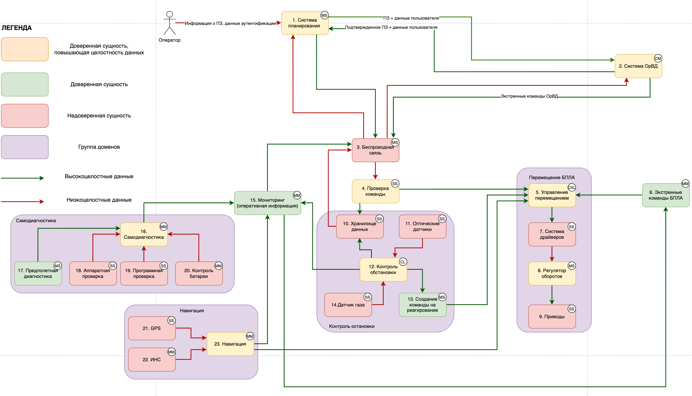

# Отчет о выполнении задачи "Создание кибериммунного дрона"

- [Постановка задачи](#постановка-задачи)
- [Известные ограничения и вводные условия](#известные-ограничения-и-вводные-условия)
    - [Цели и Предположения Безопасности](#цели-и-предположения-безопасности-цпб)
      - [Цели безопасности](#цели-безопасности)
      - [Предположения безопасности](#предположения-безопасности)
- [Архитектура системы](#архитектура-системы)
    - [Диаграмма потоков данных](#диаграмма-потоков-данных)
    - [Компоненты](#компоненты)
    - [Обоснование уровня доверия](#обоснование-уровня-доверия)
- [Алгоритм работы решения](#алгоритм-работы-решения)
    - [Описание Сценариев (последовательности выполнения операций), при которых ЦБ нарушаются](#описание-сценариев-последовательности-выполнения-операций-при-которых-цб-нарушаются)
    - [Политики безопасности](#политики-безопасности)

### Постановка задачи
Компания создаёт дрон для мониторинга трубопроводов, тянущихся на сотни километров в том числе по горам, лесам и пустыням. Поэтому нужна функция автономного выполнения задачи, координацию полётов осуществляет система организации воздушного движения (ОрВД).

### Известные ограничения и вводные условия

#### Цели и предположения безопасности

##### **Цели безопасности:**
1. Выполняются только аутентичные задания на мониторинг
2. Выполняются только авторизованные системой ОрВД задания
3. Все манёвры выполняются согласно ограничениям в полётном задании (высота, полётная зона/эшелон)
4. Только авторизованные получатели имеют доступ к сохранённым данным фото-видео фиксации
5. В случае критического отказа дрон снижается со скоростью не более 1 м/с
6. Для запроса авторизации вылета к системе ОрВД используется только аутентичный идентификатор дрона
7. Только авторизованные получатели имеют доступ к оперативной информации

##### **Предположения безопасности:**
1. Аутентичная система ОрВД благонадёжна
2. Аутентичные сотрудники благонадёжны и обладают необходимой квалификацией
3. Только авторизованные сотрудники управляют системами
4. Аутентичное полётное задание составлено так, что на всём маршруте дрон может совершить аварийную посадку без причинения неприемлемого ущерба заказчику и третьим лицам

### Архитектура системы

#### Диаграмма потоков данных

[Ссылка на исходник диаграммы](https://viewer.diagrams.net/?tags=%7B%7D&highlight=0000ff&edit=_blank&layers=1&nav=1&title=%D0%90%D1%80%D1%85%D0%B8%D1%82%D0%B5%D0%BA%D1%82%D1%83%D1%80%D0%B0%20%D0%B1%D0%B5%D0%B7%D0%BE%D0%BF%D0%B0%D1%81%D0%BD%D0%BE%D1%81%D1%82%D0%B8.drawio#R7V1Lc%2BM4kv4te3DEzEEVBN88yq%2Fujeiaqe6aid4%2B0pJsa1qWPJJcrupfv3wBTAAJiqJIkTLzYksUCZJAZuLL95Vz8%2FL9p238%2Bvx5M1%2Bsrmxr%2Fv3Kub2ybccLreRfeuRHfsS2WXHkabuc58dYeeDr8q9FcZCf9racL3bSifvNZrVfvsoHZ5v1ejHbS8fi7XbzLp%2F2uFnJd32Nnxbaga%2BzeKUf%2FX053z8XR5lllT%2F8vFg%2BPRe3Dr3ih5eYn1wc2D3H8807OOTcXTk3281mn396%2BX6zWKWzx%2Bfl5mXxxd79HP7%2Bebv27m6d6J%2FB75N8sPtjLhGvsF2s942H%2Fu3t18cv%2F%2F4c%2FzqL%2F7OO5%2F943%2B%2B2E9vNx%2F4Wr974hH1Kvl%2FdWldTlv69Dq9u2VXIsr92dsTL%2Ft5kf63i5Ov77O91cTD9ewsuz4%2FcZX9twzn3V7Yfv7xeOdfrh136r5j2%2FQ%2B%2BltvN23q%2BSN%2BHJT%2B%2FPy%2F3i6%2Bv8Sz99T0h3%2BTY8%2F5lVfz8uFytbjarzTa71nl8fLRns%2BT4br%2Fd%2FLkAv8z9B9%2Fzxf0OTnOxHN8W2%2F3iOyCyYtp%2FWmxeFvvtj%2BQUzkWcggoemggaewcUyU96BsToF8figgmexNjlQicfirU%2BgqRsbdlbnewFm3uLAJvsyA%2BcuMvJjtTJdrHJjpDJdu2uZtv5sLM9CZXZFnIVzLbjIrMtlqD12dZF2oeZbSdQpttx9On2AmS6baur6fY%2B7HS7TJ1tFyFuD5lth3U12742uYt5gneKr5vt%2FnnztFnHq7vy6HU5%2FVbyrTznl83mtZj0%2Fyz2%2Bx8FeIvf9ht5SZJ53f74v%2BL67Msf6ZdPHv96%2Bx3%2BePuj%2BKYupcdcy8KW8johT%2FALB2r20Yu727xtZ4uK88L8vH28fVrsawCjdHYraWW7WMX75TcZbWLLXlz6ZbNMXkTQmNjiBTZQd6H8UYvLFOoRz9GcoAKdfZO1i0IOzxJg5nLwJoAcx37pEV%2BGcBzp5R%2BiDBZGyU1u%2BE%2BuBv%2Fyu1wX2LI4LR%2Fc0WDnLTgSgsfLH3iKPVj2F2ObX%2BKHRN2RSD1eLZ%2FWyedZQm6LhDqvU3GxTNSJafHDy3I%2Bz7lqsVv%2BFT9k46Wk%2B5quULZm3vWVd1ufdH2DXBI6UXGTK6h2oNuD9clldpRfeyJd%2BsoVm8fH3aITAgxxArwDWoUHSM8C689JUl3bRFN7TT%2B%2Bvayms%2F0GLmO25F82u%2BV%2BuUmX82Gz329ekHXeb5R9afO2Xy3XidTieqrV4dZTR2NwzqkwMKbN8jk2nu%2FLfbbvfAq84usffKdJPpfbTvqF7zrlbvXJ9uCGxS5vu2KOvl%2F973IdLX98de6%2F3z1%2Bv4%2Bnd49viRAJzrNfMStSSDPw6m1Y0%2B02%2FgFOK%2BSl8U6eeiPfVwwc6qMJjGu4IvmQP0RT%2BYXOvBf0yxmQMVhdxpD4wvoYfIGf6LfNF3XFKA4r%2B8HvglhsEqN9wP6jZZ%2BjSDIuDE2yT2ihhgtOFn2V0wqwm8OtxxED0I1xMIeagu%2BAXnALQF6uTYjL7eJg%2BjnIPt9ozHSShTicLXAL8UPopVbE7uCep%2B5cnu1peO%2B8FmLWz7bWzhZlWWGMyxzL8oIzyRzE1IDb4p2%2BtqjK5wZM7QmXkKMxsgUY%2BVrW04X2LZR6XZ2DvqT8eGQcJD%2BzVZbvzykUqRJbWBv7Y%2FmoD5YfIOvyWT%2FMumxQrMufG7BuKFgX8pvDjWs50%2Bbbqm5WgVs104yAd%2FIlmRT4qMxp986cnGjA2kYCa0GBHGLIKrOvfhCwpC0O5nM88%2BLolH85YGkICppdV5%2FnyzoUiatrQEGz%2BBlXw1QRYGQPUZ0%2BKjs755S1qEnPdXphZ9SkV9dIIwmAg55ZnaGPh2FtiwCvpghwBwa69AAI5isyAHpNobUjBL86QOO502SG7N78IDBropr4%2B2d9z%2BuV9SHjCzHQLusPcfcParI%2BG5apxNaDJ5glWN%2FTdnRozrgG4ICbPA5HSCR%2FdQK90I3fVUNfsGC283K%2FLlmH78oLjsL%2BBzf%2BGvKgbe6PanK%2FP7CNP9K5XwTPl%2FErSrRSoLlFppilVMiA%2FHJxYShd8kEkga%2BGu%2FQvCewBiYKaKgC7unQc4PAEoYNWAG9QksDRbXO2wAHRFMD%2BW8DQUJu%2F5v5MCxhbYaibpflMPgz392prRZmf4eGiQ2b%2BtvX%2F88MAx75Q5rd1GCC8LhH0e95rnAw5XI98qAiZgLpFJ0aB%2FsTBRAt%2BHYBA6MUz2kQgDHFXdy%2BUsZHcWNzldgecqlDfvwF%2Fib2vcJtf%2F9zt9Rzbfvp2bx8J9ocQZOHWBfv9Gf3QEFHm9YwOg9Mjvg%2BF8A7QPYSRC8rNYdg2uTQK4XXsUJJzjB3IXnCUGFDlgm4ieF1dc2Ui2i%2BCDitYqUEOEyrNUrfFPmj7q2SFrh%2B2yaen9NPfwEDVKV0wegXdMhsmJv691f1z7i3CuYuRf2g%2FOH6XPjMtycWJkP0TSwHvbP90evWZMSAN6%2FvMLl8e1kXV%2FbnLcbDVq2FVJpagmYc1uES0VZdc2DC2z1CpdMG8yt1TPX3i%2BJ5Cql3snrqGCBJgxPYlNrQQBHqgyfNtqnj9hXUwNXupf2%2BOOxyh00zmHKvhDcHw49aO6Go96%2B60AkJ6RFdeFe2nL1%2Fb5dEezTCqwAx659ELRJFH4oIBel3cuqFXQ%2BNRPfTKtsXWG5Yb8FQ37n0Qlu3fbnqRhrAwtCHbTqxPln2Ab7NvXxbbZTJvaVGg4iCvdur3DvkrS4L0YGA1mLiY6urXaofkL3Vy7RCmldXynWrzm2%2F5lRd0UzskRCpDpjLrlnt%2BYBS4Ev9RUTsLRpzcAC3kFmSaXHNZCcxnUV56CQfLZy%2BWVSlzWqmWxZjlyKtevPqphC5f0F3tLA%2Bp3lYYX58daQn9%2F76ldYqv0xJWE747TNknJ0wOviQSYrmeZCWvpsx%2F3ZfHeH2sqZsdLQdKRp8vt%2FLY%2By38PTf9ZvTsA7rlgc%2Fp8uSP%2BrjJJk9%2F2PSHyS4TstPkBOZ%2BstzX78pjlLe5ZuA2gWZyhrUkzGkWxTMly5E%2FVjF8eTidWPngM1OP7F7jdbl2%2FFnnm9luskxZJdnvJmlh7Engx%2FaDGyaSMNHXJ3PLjSe%2BF7uTIGae9xgu7IfUuArm3DBJ73xF15vtS7zCp6h4uM0KHUciAguhgIxv4%2Fl8uX5K3iIjpF2yt6R3dUPTshT3XC1Tftgu48lq8S0VI%2BDG7MALrpa7hArSw5P9j9eCFuaL2ZK%2FqKXSCStoNf%2FhMX5Zrn7kP4kS08XY%2F0q29GQfsf6xeE%2F%2B%2FrZ5SddNPiUvXbhLdv%2FHfNCHePbnUwZjJrN8X09H3m%2Fj9Y6LL3Hvb%2Bk7J%2F%2FXby%2FJALP8VLBG8lmLOHnTeJd8PnBivMqIaJ8WVldP5DJ4UkjnafbIu0W6YM04uFjD11QwbpTFeU0ke%2FLKcVZO79A6HhI9Fip5rKaSR2bGw%2BJFkM3HWeFSOEY2QAr3cuipwBF5PModQBxMrsRjyxdmMasQcRxdvDMwo5gAIBc9JUYpOMqNrbaeatfAc5mI%2BZxqNOn%2FihxLhRuJu%2BEzA4k7EnddiTuL1yczSRiIR%2FUOGLoAFFC1un5APmBUqcwdJU5JAJIAJAF4qSusCUAGRIpuDWK8TKMwLwHL0HUrIpSBCx1wOaaNSwWn9HBqKKlEGqUmwfLXFK8gVZ4DkjyCEvUW%2FCquPSgwCzPG3%2BTJgu8M0rfKAvh1HkUJeoObh0C6%2BdTnywBL5F3Dk%2F9OEp0kOkn0y11hYEXtEY1iYqvQ7wMgsGxNDIX88hDsP560aUgZ74pJVlQpFKJwqm0sWU0MZK8Qm5v%2BUjWbkdzwe8FnK6Z0AuYuBGN5YDGY1pxEPDfaooQkNUlqktSXusIS9paEFCouLdlhCwV0zZIhEFRD8Cwun4J78fsi5QY5rpSeGaJcX3rmg1Bf%2BjoFTwWfEIr4m2I%2FkGy5YnKgBgErTKcnsFKxKfAwIzFKYpTE6OWuMBCjLpCeii6M5k8DdHU0FkYBmW4HuZaFILyXgkyr7bZculVZbEMwmo6%2Bb%2FjDC4xcIZrP4LeLriSk71ZeburZhxYgx%2FaqYuZJ1JOoJ1F%2FqStMto3i7tIOIp7k2Exp2RfYJFPaatEMkRxMI820g4ZBYRCdEn26X3xPj4PAUzmqer3JKAuGYBeHknvNluun5IBXfvtXFmieVvjDg%2F83CQU%2FrjbvyZHn5Xy%2BSGhYiVrvLMKfMTW7W7QDBlH%2BfuDpUf42703dfvGjfqP8j2hZN8C8W16z9HDxo24aeB7deU6rxudWB857WrUu%2BYJuAud7baPYRsWBMsnkYioO1CZlv7eCPXjKQK%2FJv1YTYjmylOslE0v75SkayT1X3XjZgY6b2gVOy82GK6cV1usp0x4bVJoVzb0UW4Wl4UpoUm659mx%2FpQr03QvBW2duPtNrrck28qAvsDyKX7ufdOvlUU5Kg%2Fb1BEImKpBMoeckAIqoHsfUKHVQCrpncnZi%2FtkBJj9LkyXoY7QoV3qs0qVVtGf910CxL0WuDLCUiV%2B3lMnAelT4SHMq91PhZpAsSkztMGFDFlZ8yB%2BjoIKr1inqn0mRTgLcRjakhF6p%2BrEHdhY9TDj%2FDBOA0fytdlJ3c9fI%2BmH3mj%2Bw%2Br2THN6HKIgWD66T5%2FDaTuBNFq7lTELnMY4Xj3ZCLo8HnA%2BUw0teMvKSkZfsUEBEA%2F%2B8kJ5KmFa9trRV4QkMSHmIFWQXvVAbimBcX9YcyIFPoolE06Wu8GmiiRkyXu9k06Xwk7uavUBYI1uRSNC0Ica8M4wM1SfF238LXh%2FaV%2BERGACFZfIWrwYNJbBjqCl%2BCnryPT4gyViSsSRjL3WFhxEkdaJwBrFOUjSTuDsP8lXFaW28Wn6mRCqSeCTxLniFT1Z474Dg0o2SFbn%2F9WtPmQSj7kMX8s2SDaAiTwqePOV1AvI3AgIcr3MFgv0LNCs8%2BzDAM%2F8bykIbTOmBpDAFowpjri6l0SZ2jNcnEKlteQSC0TyLSW0jQxxD9wjfYGQnrRz0bYYFpC5J0Cl2LJXUQCpKSUPT4hLU5l2OwORUQOiWgapFRR00DxtK2TKvtSN6PqF4wUheUatsUYwwjJJ2qHmWpEkIARtAlwIglPJaQdxQF4LZiTdt7f0UvdxG9LKH9KbyPUd3qImGVe2H0%2FRapLyP1h9DiKdhfm%2FxNI3C%2F7R4DSdqt39Q%2BOv6jzAIHuIv8%2Ffgj%2BjPr389r3qKrG8YkXx%2BKusrZv5wjLujiitD3fq2wj45O4GwALeiE3FFE%2BGjorw%2BSIynuiu5vcd4%2BgOK8bTPsyv5VhyxACMA%2BzbwW9%2BV0Na9NtIEr7J1RueCRc22Eele7QsWvAEFEm9UyJTkb6aU2MInUl0sqSKZUqSqW5rJUU%2BsZFgnvOE0oOCs20oDCs9irkwARZDmABtQoLMR9JqIJefW1O3mqSTXnN61q9PsmtqtfSolXteCzFX77QSqIMsf9eTOPgFTbuRH1Z1BtQtCq11kj8tVu0Kuli5gIf10xOYDkas0%2FNHMlSSuDwqo08W19cnxVWnNWpHWE2ZFCkI9l%2Fz2kTZ6SvrIKYFiH0OBYExrlun2rUEEQS8bb4%2FZzI36%2Fp1Bgei1pZ6rWib8qJ4CcXR%2BrLbvegfqAmgd%2BOQLOtp3dUMJ2Hc92cVgyTVbInAcy43LHWzFXsvdk%2B1Z%2B%2BtvjpjgPI%2BJP3JVUwomCF1EEDpdCcIQaYF32zgX%2BsQs6I%2B9%2Blq%2BlH%2FGxUflMfN1DqTaDl1rn2FYdxcchnMnQWaq%2FT6s3rwOXtHR7sWbm5ayzBdo%2FJw9YevsdBeamc1sbQ%2FrvZF21HOJrfoVthp7AwYoxjhNH3Yzem2LsdOoxdKkBAtQb2B1Zi4sYot2nYFJBjCdwpyBWwqaDyMvRF2f0kTfv7zArYtTGHEGQ7raXciPDXL19XawqgDsnDpOhLeJj2BGE1w5B3CzyAhCDbUfey1V76qITwMrGSK1NDtbSGZhDduVNdk9x2nCwG1hmb7OEvSLXTydrdlmvY%2BX63TSsxWbbVar%2BHW3LK3ls%2Bflav5L%2FGPztufj8G%2Fd8Y2tmKKE0RRMdhAhbMMs1VfU4nzriLp6vn9LIyevnzfb5V%2FpNK8EfJHXYPe%2BfFnF68XPi3iuHLrezGXQwxlnuX5ebJfpGmSJA9kZq8XjvvjIUweyL9tieix0fefbzeu%2FOGpRYy0K%2FpQ9JlkDuhToebdphLmX5q%2Fw75k75TUBkDebdfLE8TIjjDTo%2F32xw0nmAHEfJppDNNFdMVvualFlKSw3AgvvH1UrC4IsJVQb5mJl4tpEhsk875fx6rfUNbV%2ByiQAEM%2BYMJUdWVWEhwUHI7RzHH1mlLbY3n1b5ATHMvn%2BnkVKCwlVfHOOIafwLORUjFbOtzSczcvxVQ0n8l6u021tpxFpC6YBATjqSLIPQUInk0lyaMml5tUh765YZ7j2QdgqKdUZ7iykhBWZIlJqi5Q8HpYM195Hkh5OIKU6w52DlOwjpBLhq%2FPhqx8ySfQHt2xd1rBGASYFtrrGQBka%2Fq6fc6%2BnHJLUAzx8FM6qBYwuEGdxAYZEEFRnWTDefBwmxtYPw6vIdBYEXKfqSyjzy4lxfUoxnJrvoqfDNnsGC6sITDxayx4zJkBrG%2ByjsBfqwcIjOuce6jR4uAo2rH%2Bt%2B2x1Ay1nnDKgl4i%2FCfGPCoK7BMEHDMHD%2FiG4XgO8wxjvcUootzZZjAFCG4JwYR9dPRzh1rwRN4jlhLZ2WBoIgmc9rtNcWGUaFOyClmmRqvFUvKB%2Bi%2Fzye43%2FYN0euUoPYYOGnDdGYGwIjj7Y71TnQbhF6IVMq7PSKrhSx8OR%2BRnqVDq4uFw5YluC9OrsUNTCkCG9UEh7xPR6FINo%2BxUxIBRZpeDURTgMARWX2wCaBRxnkRgDjEq4%2F%2Feye1KVGQ5u2BVoQ3Sagvuuvs3DIuwBqCvI5HqUsAi7KctPFF6%2FASeIJHxQsRBPjlA0gQAMcqPhiRtwssBeun2QV4RXdQPo3ypLHpNn6xT2HKFygPUaa6IcHMts%2Bf4idAKh3MMIOaH7KgAcRjw3sOjL1XNrcTJ8HaimyMWDid0asduYQL2DOJYJ1A8H1CPJzGcG9Y7uxuyhyuMoRZdgTgLy6WwgLsXWgHwdKgZw%2B%2BhLhEsdhpHoOW4VbUQVBAABiu7inx4zpo2ZTxnvewLRUkRM3CUTjxHu627gRnC%2FJk06Gh%2BZlHjffCNPRv%2BKvlHhtYYPoFxlfkfcyC8%2Bw0Ad3bB%2FA2YAbaQA34jbKqTLFd8f%2F3ycGLSwsjQkDUgbUWcH8dGTNjIYbcRGMpXPrY3ovmNPhA0dbOamm310Edu0HFt%2BJgk5yMakt6SzgfhNb3txQNQASahJUurOeKNxwEGWMqGWio5RU%2F7BBfOj15HAQhmIEZsw4hh1D0PSfQPd4xrQJ3c7lAhbkKUrA2WmdWqrqcPoHcf0%2Bx5bma3ZkxCXNeGyMWF6fk%2FC9MPE9HWzcb3OML2ru3yHW2BylBJO8PDpgL6KjBoAenW4s0g0xGfaGqBnZfx%2BSdT3ktm%2BJHDIB4z3s61A1UrDXmjyN8VQh4B1TD6EBmjjuridhPK5k0G9C3zx6EpRLdRgj%2FwtFAuAqUPtHbF%2Be6x%2FrApxgiioM9xZRAGe4zuFtAcpEwbJVUYBSd2asZQgWydvXSWA4kXhCOWpaBvshBdqA%2F0TeKHOcGfhBUr5HTTQR7pen9l47%2BrO3qBZ2R1Xk2eRBrtkryQJMMiiZJhPZ8OQEXwijle2bbjdomZvuJ0fZe0GiLk5rGdl%2BL%2BUikjRw8dyzAgt6K4hkxemnMMkVjRAX69ue1cok82FPeQmpWxUYxYjdmjCDqMydVOG7JARMNYy4dwIWHc5hgIBQ1uZo8XiQRsgD%2FtVs4HAT5J2TzjYwKiEg5PZ4MaCNnGwmvipEGpyzVTS7k61S1tyZKtp829QC0eOSikvOeRNwrMCRShARQQMcehRHDpC3O0ZkmTr4O4Tuaw66bWavLHLjZ4vpRYE5CxN3EiIHkbiW4dcV2CXRMbUC%2FAQk57EpGPSBjzETUzawHC0gbqdoLrTBjzdexihqbUVEpHkEOA0gvPpbDTNk83iIQ6EpygGt7b61Sv7OlbXWo0pEbsyGiziUe2ZEzlljLC6vWRUWN3VAifXQMSkL56FsEcFRSmvcshQFOv1fm4oqnvymCUs06aAyhAYz0Jp%2Bz9cwTYP%2FyTZBbiT4Gs6G3i65PQeoDusmFqJA1FzLWx2KuKMoS1McSLnJmmGlW3xNG1MBGDAoG2R7CVGFiZjpnVHIj44ig%2FGCE7by1ZsQKUwNZCbjBGnjtIswMJil7njh2i%2BEc2PCbf6iGeScOtwcKvXO271kU6eopVn2T4dZk9BXVz4iqZAMOroVQCMAJxGdY0wTiUMm84G4vq5FTHuHth%2B5aCdMi4S0hrI0Cl3UdQpCTfk%2BlRPGLYXPhghhvXxdLnoYCEbHcPWbvqKYNUpsK46wLoKfSB62UvBmPoTmqIaaibxNWNYJd6pZiYgMWkTJh0V6KY8vkGD7rp5fH53oFv3kzHRvDNq0BexmQmBIIfMr6dD7yqSaQC91eHOIr0MSX11tsdQwwUNQAcDTbjrKJDC3HxTXl5iB9Tzotm%2BS%2BTOQFENWOMYhBJ1VQIE5m4FlfCNUXWyQYqHYzWSE8RFneHOIi7a60V6lHAQ%2FGI2BsBNjyi5ESXXhu0nUHKd4c5CyZR8OGTY7g3AVq57EJmj1N8wbd9oxFqjdCik8YAF7BkhIv2Mj0FSEfA9Wd6T2eBB%2FbjlvQ44bQaNG0PUVrgBWv%2FbKt3dhamUUcrC8Vw7Qj9B0F4TUHgQrY8JaR7W59aZBW1hV23hUnxyZOE6E7OMyV4fIM5mAv7DAf79190LdLcrK3t4HjJS2hCQKHlhJJ0A%2FxEAT2cDzz48U%2BgLxa6ch5DHiEkrkwNHG7tSM%2BzEtIfAMe9qPDBpkM25dVSgmDIehwyK%2Ff5L8QVIxqNoJRnBkkcQacj19yTIkck3Ek2Q%2BQgRp7PRTf9HsTnrONoCYR6H9mc1BFXBMhZ4SFiFBiICihw%2FM9OMEX3j2Y%2BSXwd2EIDEfyz6VqpRHouIp%2BBkZbtgWuMjeFpF42JTxFcDttU9VY3TQYltm7DtmGB4SAmcg4bhdWvgBZ3B8BBJ4PSVoBQoiHTvOzQt3ALxxTQZOOXynAQXYM3TQXoVdTQA6epwZxFUiBPtDCC9IV6WA66l2tYMPJInn2nurdTQr60Y8eHIdwCzKJZ6cTsxRdCsnz8DL7qCmAIhMoJOfFNrPRhye6vd7lp%2BZZNmcwdWAYYEVCfQWljZNhmmkSg6ThQdq%2FqcIJrqDHcW0WToMdmF6gNPO2p3ZZVFFY6SRTdXkg3jRPbHHuAIaSCyc4hPm%2FBpbV3nBD6tM9xZ%2BJTyZoes6wR1G91353IIkbzZAC34DR20ep8SDwguWGL2%2FgQBTuqRgZvJh5HOhiGr9mA%2FHc1wWZKeQq2yLVVlBR2tAJhQF27TZt6MwEfobwjNnS0FIQVA7YZm98isidZUQAWRKwooDM8UIxMxNyHmEVnhbcvsYiUgen4gGvYNRG0LyQQVfSiLUhn34K%2BlybgK8Hmv7bj6pk5QE2FPgprpbPBa%2BOrOC11BeuzoKTR40HwO1SkYml7T4uXI%2BpbyYJGmjdGefixbjA%2Bg2szcAvIUgAp1roBTr1UW7JLgKzSy1uc4ivdqSN6jgqwuQdbhQNbQ7h%2ByIrZTvFmiqI6q%2BIxuwF8Crq2IMLKRwtkw2EjPDFwttTJw0WuR4jWPpdkRokqrG7MnocrhkveoUKV54yZUeX5U6fePKnUt2rZOqWTNJClWfoYSkESVxIyEHrPZsAeBHhnITYLnT8GufaPt4LB1BZWvPZ3ex4g8Da1hCHl%2BWPIeEfJkkU%2FIczjIM7L6Rp4s0jVtO2tc%2BNOXryRQIMsQPsxmw1xFQqgd0BMNoy5hPb%2BKPIl7basNQdpTKCtDlpxucrBUt76rhth9YZeRSJyW8MQEvJsN4kr5gxLLHMcy44OYLMJrSJwEMS05BxAqPzBqBPqbeMw0UWwjih0VajSrzoQaz48a%2B88ginQt2S4772WyJspkzZSRfIEcRCAymw28OO84QCSxyMksMkbQaCj7S6Dxkih2TKAxpGyfIYHG3rN9WKjrvbbo%2BxbB0qAwG9wB0gfW%2FbsnGQS5jIBlJpENSTsnls9ScCDMmFXq155SSssCRbTqwFcBJjOQXIRXZk%2FFp4GYgyBlBbN0kLpTh3QZFW1tTJ8jApA2s3X6VMlmm95%2BMa8gD0A9cK2vbOfxceHPZhq9JL%2FMg%2BjBstCFvHlZfLF3P4e%2Ff96uvbtbJ%2FpnkCzkscs4cbgJpIBnk4CXVwMrwWwEn1W1iD4tCJEhoS9tzvfcW4RzF5vv0H5wfP%2Bs8%2B1H%2Fc93jUJdJ9F3OFvg9P0Qeq53Xvr2Wf%2FzjZhQ2pzvBUsoPMDmO%2FIDJz4vfXtO%2F%2FON9b7xV%2BlO%2FJB8eMoV3vzA4yaZELgS%2Fn%2FfNvyHyS4zB6QtAJn%2F%2Bj2%2FrPhdDFSC3yzKLnLA5wy25w0GU2ic3zJ5qfyu8pMkh8HTKeSRLMdepgF5rQsEgYCKeLV8SvDG7WyRooXkQLq4y1m8mhY%2FvCSIJIM7GNGVZNkt14YKFYW2TkU%2BQkROd0RkyAQ6qliXJUcoizoHDsCyaE26PKReRNXfyzdlvI1CCG5xJ%2BNjeFNYFewau131Y0DLrCW%2FIAMNHQZJsimnFUY95nZJwravAivetVeyV5yXhg0xU%2BekYaIKGY4E%2FVOFIQzoFqw%2BUUhvFOJFvVOIbbBmipoCIo1ALpJVq4u8KSdm9OvO%2Bl93xDCnLtNiPZ9ut5kta7aKd7vlTF40ZTplTcWywtjSLWXZL14Afvm9mAP76CVYzJ8WlQsAptdDZpcf2y5W8X75DY5VadT6kprjqhQjl0NaPshu87adLYrryqXTh7JVdKwNtc88hdpQrVnEOB0Yy98y0AnDkluA1QSfzFCFHwWc%2BWkkQGSqcHWd6dwCpIYl7yQBsvCYiwuQa9uyPrYAcfzWBIg2VOcCxBB4B%2BPbAhIdfYkOB3ECdCY6fnv79fHLvz%2FHv87i%2F6zj%2BT%2Fe97vtBEMeR1roLIOF7vNXo%2BVNFU2r1fJ1Z1osQB3x7nUxS6fkcfk9Xb7OlsrlUFwYxrh4gSuFLJTd1UIhSKCthbr5fLkLxUTLFWH%2FQaLlz7pS2F6cT%2B%2FuNV63x1L5aBezUr6lLJRne%2F0uFOaOa4mlvl6w7NMWSgjDvhYK8%2BO1Jfv%2B75fLXSlmeepSsZ6XyuwCPB1PXPI25bhDYyrEz0bSD%2BMpp2%2BeQrxJhNGxlbL7XinEw0M8ha0UQwqhnHWlsG4PtFS27fmq9HP6XqkOTRSXvFKBaqLof6W6tFFcMEz31ZWy%2B8Z%2BaOQvQQqdp1jvPEVGCnyfcga3Uh1aKS5Z9XU0fSrqe6XISGGA6cpC9a1OYbHAtE1ljsShab5YyCvtU%2Bm%2BpIG%2F3peKrBS1xF%2FvC4WFg9I%2Blfw6OLsfGsBJLGWrID3oe506tFBcMkcp69Q7O3VpnrjgZdL4qW%2Bd18aghDKNUg2oK73e0ywtBrVcp0F82WzqNZlmz8vV%2FJf4x%2BZtz8fh37qz2SkImyGiK8LmmllBV7PtYHigarap4ladilvVlH1UmSWUIly7K3ow1HOBVTXvQI6AnAekRurCYpciiUyvj3krd%2F6pTlgL5ZNhr0jYU4jnMSGPqkQdf%2FB669vNexbVJyRh8c2tT7hCSHRLuMVoppIynDSrhmu3pAw%2BGRje%2B8gEdCqRJIeWXDhfFbihAo4wHX5wwdkSIdUZ7hyEVCPBhgipKSG5SEPGWiLkAiVSjRpAREhNCcmPxiORahQ3ImXg7MrAD5kgDkIstyvdwNAU3lwjoE2M7scvqThaP%2BxeMcvKKAWcV5uGDm5bFUTTZBdUhjuH8MKLPE1NSqeoY8G0lsekTZ6RMo8G%2Fs0ptc5w56DUGu3vGthYSEC2QIb11YbLF5iG2lGwnccNVviHYe3gczKMiOwakV19JePipZ9LHocBKxmhX1PJ6MoB4eoOCMb7e0wZ8ABA0OUBMSVKl92DWiPKhlmnS9cY24NUM2wLWsbF29r4LamUbMNSssRB7WpDF290dBE3SMlR17K3t35zR8hysst4mtF9Crgsl48b6r%2F5JaOBo6Prs9gSQY%2FIHeMi7pgSvCibA%2BO935UGOAernvF9QzJcwa5Td1whqxhQP000s1L2LgdDXkpMRjWkUrYFfQe7LjYW9RWgrgnh3jX4HJH5oxU2HZGzyyVn14D1UGbrFZTPrIjq3i67kSIage59Ecc2JJ4AB5JimUwG9SghxbJDDhqhYmlws0Gp7QFCd2VVU27KWnRGLVRASKHdaqhmTEJ0TvpmPjkGP96dYQPwNFlsS4SsaqNHaYJ6j22lHbHocsy3q5JvKhzeSjVwsQ%2BJ5zGHY6R%2Fp5KRp2xsoHRA8Q3bm9Ax4Z4K58Qtdibi1Sa8OiKl0yPn55CVzroJeVWNkU%2BrSqx7Px2udEYoqEDtbndAVprUAgHtuVwu0DeJsJJLW1BMKyilCbxQhjuHyDJ4PAfSYo7os121rzm91hnuHPRq8CdCyvM0KRkCImOyRid8MqdQPHSzmCBkjnNv%2BDkBgLF3%2FKAj31EYWEKgWIbgHAs8my3fHW4V%2BSU3lTYZ%2BMDCFoQqscSiDVi0vsZ6%2BVuKoYOU0oJO0B%2FsT6kTNGTRKWDyAJypa7tCo4SsCDveQX62ZNx0J1t6FD0RhmVTPGwzZqivEl7%2BfkV%2ByAGrhFjdIlQl9DpTCXU%2FpCtUQpMCCIXXFIgwCzTls0pHZSm2yJKFcObpamAVdTTYs9XhziGmyD9J%2FskOOehYRfUEjqoz3Dk4yuCfPIdbkQFmEuAWaoz5LsEZ5dSHsDQPjs5wJhFSkWhriiF0wJNAOXQjM2i9%2FZD4uAkf19ZmP8DOaPC%2FNsBmik8U9k%2FWHbHTY3YryAwKw1iyZQuTHMglHnZ3i7tj77D76jsmWYxO4bHaSvLl75VcmpCSPEglGRH2uN%2FUMRPiaS1Cdb%2BpJ4J1hfkQRqlYIOylGrBAdKOgCXHcZP%2FjZ5KAAzzcgle1go6amMCV4c4h0AxeVVKnSZ1ug4OO9vs256g6w52Do3rMI3WIPBuRZ32f5%2BULfENWKDSHWABXiJRK4f9UfJ56xiePyTWGpysOzOCQVlbTQFJxOyVwWLyLiDWG5h%2FF3aqwKTzhDrEbUQJoGxxZ3%2FF6%2BRsGOV4HrFM6fFPtT6fUHa%2B%2B0ClvgQlOz4JQcDqT8%2FZryNTCCQvifosEpGwc3uxy7NKtxfzRy8cXA%2FDPEk0eQ5MjVNF69HiSBaEZeY5JRcMdeVOGSTzdiswMpXxg2qG4tsIabRoHGtI8wAp6hUNoyXMK690RwIOsGc1YZUS6U0D%2BuCHrTm7fVVwD3R8XNKvi6mqCMjJgWWEIIuFV8ieV1kkmw%2BBrowzGS6DP8RWuCSo9WRV9djhBSxVs4JkKopwCEg%2BBIA5l5UqoXhA8KnFeMJYiBBgW9SjAMDdFuEOszQGs5GCAZT0cwIoVlSGJ3xrw24gK6ASGdETIJJDsIJNUOOhuAHUywEV8ECSrGKYUojnKFkjS1ZiwMBHfEcU3ovgRlaEJyPU1ZPUt7Lv2aaC7vkKhvh3v02%2FizScRVnIpKXHJZAzAv0UBkx%2BXg0aoZvbrjZOdIxRMeTLpjkljM5c8rUmlR9VIgqaJEHDHDRC70M9W36YB3YDwkaDaR5DoFK4YkVYXklNuwFqd69RNkuuqf3uoO%2BUitJIMKonyiEQKsjazHXVhTyaDfG0XTJ%2Fj68UeGnxttwC%2F6X40SM1oLzPXQNy%2BPAiI8pbcWHJxiPzuRMpNSHlE%2FdzDygwz3s6kVMur%2FbuixaBjyHHgFW1VZQkWrIXKmMV7PzA5C40ZRqiuoQstZxZoSmGBZg%2FEMA0YZkSd6EPygg1ZX%2BJu%2Bd68YKHuBWOWcIN5mp0HFv6AkTAREKhkuK8nt8j1BSbD4PoineoS6HN8jqXQ4FhSwhNNIYNKGJUSLKj7TkV%2BjQw1S364BxTPzMRNoLExcY%2FI9RQiricimiZEMyLPTESemQFrGh6rmy7VVamJSPfMMCZcM2IXqxmgjxZctgCGgy5wspYgbEoFJZLJIE%2FOBdPn%2BIpLRJWenItLiiI9Z4DsNKJiGFE3PdoU95FC2UrJfIVqdR4ThA49qnqCAZXLakbuIypoEZEvaMgaGu%2Bx0ZsvKEJ8QbbQ0CAGuDV4ynnIsBpQj8YaK3V8SE%2FDmZW8Q8lkUGIUJUZ1yEHj819FBv9Vp6rjQbcY2ptEaRgFawPwWm7I3tO4ownQV6kqbWusNSLvWVSjV1oI2ElQ8w2mHyokKwCU2ElCecA6BRhDsKUwzELjGXZUfRdFXwGezHcqnJlP6ztEmRptsOaIfJTMIiflgFVg39Ip8bxOSmYhXkpHqep4sLMIRC%2FHVMHHi4Z54CoRA87UipDGxyCZCNienJ7pbBi8nuTpHCxVjs%2FVySyDr%2FNMvc4IWrZBsCNyJjIL8SYS2TQimxE55ZhFXrkhqyRu3Qyt7lQSxC3nfgJ7oTns0YZagwXUFjJjyrxHekE6G5SDdckUOkYdoV4WFsVDWhRW0ZihRqXDGHxXFBE5IoIfk%2FbFyCE0ZO2LlwXoLSaSMcQh5ImgSBiMAnd4vd97CM6h6r8y71GIYzob5JW5NKocX9ggYz16ZQLyyrRDsCMKxmPMkOM18EBXMWxFC1FWFlmPANSIOEcSdzTijjHFwzFyPg1Y%2FQn4JT2qP4jzyVfi4dC4fCHeoAvKbJssJSiZbWTOJOUonQ1KAKMEsC55aIyq3Ll7Y0lRygITC2KucFzBZ9BTRixtJ1GYyAIVtUPALC64I9zE0PQaYqgmDDUqVdPgPKujakLKtw6Vh28jj5LsKu0T%2B5g0R9uM00lRPLuiGNRNnOqq7xazET9ZgHbegoFkEEpfS6IRx%2BykW7Yh2ewWHW8X31KGcZMXOd4uhirH18OL2QbHG%2FQPeLIJDkpN3hqplMcF%2BDPbe4n4WtJsPoCINDjR2upFrOhAevbzVEYFrGkv4uriMVB2W23btcmE0JDRRtSti9lmyy1pVefWqkJuAejP%2FWYj7rdQaFXQHQETAXSzKKpJ6ZWGdJhLehPCneSTy2aD0sUumUJH6PGyP1C62EEwe0NgdoDsNiZ%2FmG3whw3HGHysb%2FugFgurL8LW5gH41dGeCraZ1m9UEQVC6uzlSYAxOQkdchIOSJ316ibTdVbKxEGchBHqJBRgSbHt3YC%2FpNS2IcGcFp2Bl58A7xicgaTUXgSFjrAGivOBesKRUnuR7DamCimOwRVKSi0pteOVAGMqGeOQj3Y4Sm1k6VvPmX20ju6jta1T2uYJySZklB4QQ5JK4kXyyGazgXhk0wgC5%2Fs0m1N%2FlS7i7jVeS6Tj%2F%2Fdts8%2BlRLqKadnY7dPD36w85ZH%2F%2B3s2hPWYyLTJY%2FyyXP3IT%2F15sfq22C9nMfh9l4m59Fdmv36HP%2BQ3TX9Zb7YvqXAUv32Lt8s4%2Bb9aPsX7t%2B1id%2BC8WSLRDKe8FwuR%2FuhaVv7LarFPlmCSvP5suX7Sr9xsX5%2FjdTGknR9LiGo%2FiZMnWueHZ4uUVMFvy%2FU8I9H0R4u%2FavZLIgbXu8dkfH6njDVyytm8y7d532zn8oOJsZJ3efhzmQyXjpnz5aSgPem8h3j259M2pa2Jso62x%2FIlhB%2F%2BDp50vphttvF%2BuVlP9s%2FL2Z%2Frxa54vOV6mcoS%2FFywlpXngceRzksESbxXJ2e%2B3L2u4h%2F89NVynTLb%2Fyxf0t0lXud7CSfY5NNT9v%2B2RwtNzlQJw%2BZ8VTyRxHblR5LZR8nsEcYoOBSjQMpcv%2Bw2phgFh2IUyJxDEmDEMQouxSgMyJzDKaC%2FGAVXj1GwWWrO%2BenLV5InkGMoYiCbDYoYuGQKHWHEgGuIGLABDNS1zDvt1xuZeoVemJcmvS4Ao4SC75ALD54AjxdW9bBksSkjmm9G82Ny27tUDrchlYzJteuSa3dAukBYN%2F22O10Ace3an2gTOshApBpks0EZspdMoWNUDQzep7ZUA9i7oCsFgew0jUl9VBpBRFTSjErGpBF45B0YjkbALF7Bob9oTw9xDzhCJbgFeyD0R4oO7AzUFc9xHMmgkssojDObDYNHgZpdwBdk1OyiKQ%2BNMKzOM%2Fg8WoyrsYFWo4cJQZ0fK88P6vFTe9iGBD2mwDWPHBoNqeRjBjeFv67%2FCIPgIf4yfw%2F%2BiP78%2BtfzaoIIvSJe%2FZmBUPXsSJo4IdETj7JXMzrcT5ZbZB1ggfhTBmQfjEK2AEpAmwSJSPr8UeTHSw7rzzxffkMf%2BWGznS%2B2MPPgW7z922QCj8MMCJDh8Z%2B33X75%2BMP8eqWcnphBjuhZxMBPAZgYWK6TmVFQPpSYgex9e58CUD18AmBizXjZ%2FLNvJoMPOnGHsq%2BOuC%2Be6wOTayqWLVCWTVkePZxZ6TkEzbw6MBegxpQWQysCVgTt2luuDuxM5himOgD8oFgWoBkCmuhFFLZQ4%2BBCK8kfrmbLqGBdWvTabHhnkp71K18pjNm4RV8DhlWQZ7oCMsqU8WOBChGgKJIeb73y278y9DixLQNcxUBotg4LblzV0ePNy%2BKLvfs5%2FP3zdu3d3TrRP4PfJ%2BxY7DhhVlAAzsImOXFtXelwGGKTFLE3Rxglk6%2FbTUpCJSpMpuD582a%2BSM%2F4fw%3D%3D)

#### Компоненты

##### Описание компонентов

| Название компонента | Описание компонента |  Входящие/Исходящие данные| 
|----------|--------------------|--------------|
|       1. Система планирования   | Проверяет данные аутенификации пользователя и данные о пользователе                | Отправляет запрос на регистрацию ПЗ      |            
|     2. Система ОрВД     |  Выполняет контроль возникновения ЧС при выполнении/старте ПЗ| Получает исходное ПЗ, возвращает проверенное ПЗ + данные пользователя      |            
|      3. Беспроводная связь    | Отвечает за передачу сообщений между БПЛА и земными устройствами    | Получает сообщения, которые направляет на БПЛА и обратно    |  
| 4. Проверка команды | Отвечает за проверку проверку целостности и корректности входящей команды | Получает команду и пережает ее в систему в случае положительного результата проверки |
| 5. Управление перемещением | Отвечает за передачу команд на изменение положения к двигателям | Получает либо рядовую команду, либо экстренную команду|
| 6. Экстренные команды БПЛА | Отвечает за принятие решения о необходимости экстренных действий по сохранению БПЛА | Работает на основе анализа работы БПЛА|
| 7. Система драйверов| Отвечает за снабжение двигателей необходимым ПО|Выдает список драйверов для двигателей  |
| 8. Регулятор оборотов |Отвечает за  объем необходимого для выполнения команды напряжения | Выдает необходимое напряжение на приводы в зависимости от задания|
| 9. Приводы | Отвечают за перемещение БПЛА в пространстве | Получает значение напряжения |
| 10. Хранилище данных | Является контейнером целевой информации | Получает информацию об обстановке |
| 11. Оптические датчики | Сенсор считывания оптической информации| Передает данные об окружающей среде на основе оптического анализа |
| 12. Контроль обстановки | Анализирует данные с датчиком, сохраняет их и при необходимости создает экстренную команду | Получает данные с сенсоров |
| 13. Создание команды на реагирование| Создает необходимую команду реагирования на изменение окружающей среды | Получает решение домена контроля обстановки |
| 14. Датчик газа | Сенсор считывания информации| Передает данные об окружающей среде на основе анализа газовой среды |
| 15. Мониторинг | Отвечает за сбор и анализ оперативной информации | Собирает данные, на основе которых отправляет оперативную информацию |
| 16. Самодиагностика | Отвечает за сбор информации со всех систем контроля состояния, а также сравнивает с эталонной оценкой инженера | Собирает данные диагностических систем, и сравнивает их с эталоном|
| 17. Предполетная диагностика | Выполняется доверенным инженером |Возвращает эталонный отчет |
| 18. Аппаратная проверка | Базовая проверка всех физических устройств | Возвращает результат проверки|
| 19. Программная проверка| Базовая проверка всего ПО | Возвращает результат проверки |
| 20. Контроль батареи| Базовая проверка всех аккумуляторов |Возвращает результат проверки |
| 21. GPS | Обеспечивает позиционирование при помощи GPS-связи | Возвращает координаты |
| 22. ИНС | Обеспечивает позиционирование при помощи ИНС| Возвращает координаты |
| 23. Навигация | Отвечает за анализ информации о позиции БПЛА | Возвращает позицию |

##### Обоснование уровня доверия безопасности

| Домен безопасности           | Уровень безопасности | Обоснование | Комментарий |
|------------------------------|----------------------|-------------|-------------|
| 1. Система планирования | Доверенная сущность, повышающая целостность данных|Для обеспечения ЦБ 4 и ЦБ 6, ЦБ |Сверяет данные с базой данной зарегистрированных пользователей |
|2. Система ОрВД | Доверенная сущность, повышающая целостность данных| Исходя из ПБ 1 для обеспечения ЦБ 2 | Осуществляет регистрацию пз на основе диагностики окружающей среды |
| 3. Беспроводная связь | Недоверенная сущность | Находится в недоверенной среде, что увеличивает стоимость решения | Выступает в качестве брокера сообщений |
| 4. Проверка команды | Доверенная сущность, повышающая целостность данных | Для обеспечения ЦБ 1, а также обеспечение достоверности получаемых команд | Проверка на корректность заполнения полетного задания |
| 5. Управление перемещением| Доверенная сущность, повышающая целостность данных| Для обеспечения ЦБ 3 | Формирует базис для создания команд для регулятора оборотов |
| 6. Экстренные команды БПЛА | Доверенная сущность | Для обеспечения ЦБ 5 | Составляет и отправляет внеплановую команду |
| 7. Система драйверов| Недоверенная сущность | Домен не имеет критического влияния на работу двигателей| Активирует массив необходимого ПО |
| 8. Регулятор оборотов | Доверенная сущность, повышающая целостность данных |  Для обеспечения ЦБ 5 и ЦБ 3| Обеспечивает стабильную работу приводов|
| 9. Приводы | Недоверенная сущность | Наименее подвержены атакам | Физическое устройство без собственной логики |
| 10. Хранилище данных| Недоверенная сущность | Не влияет на цели безопасности | |
| 11. Оптические датчики |  Недоверенная сущность| Не имеет критического влияния на цели безопасности | Выступает в роли простого сенсора |
| 12. Контроль обстановки| Доверенная сущность, повышающая целостность данных| Имеет критическое влияние на модуль перемещения БПЛА | При компрометации отправится неверная команда на перемещение|
|13. Создание команды на реагирование  | Доверенная сущность | Для обеспечения ЦБ 3 | |
| 14.Датчик газа | Недоверенная сущность | Не имеет критического влияния на цели безопасности | Выступает в роли простого сенсора |
| 15. Мониторинг | Доверенная сущность | Для обеспечения ЦБ 7 | Имеет критическое влияние на систему ОрВД |
| 16. Самодиагностика | Доверенная сущность, повышающая целостность данных | Для обеспечения валидности оперативной информации | Имеет косвенное влияние на ЦБ 7 |
| 17. Предполетная диагностика | Доверенная сущность|  Исходя из ПБ 2| Обеспечивает корректную работу модуля самодиагностики |
| 18. Аппаратная проверка | Недоверенная сущность |  Не имеет критического влияния на модуль самодиагностики| Предполетная диагностика обеспечивает отказоустойчивость модуля самодиагностики |
| 19. Программная проверка | Недоверенная сущность|  Не имеет критического влияния на модуль самодиагностики| Предполетная диагностика обеспечивает отказоустойчивость модуля самодиагностики |
| 20. Контроль батареи | Недоверенная сущность | Не имеет критического влияния на модуль самодиагностики | Предполетная диагностика обеспечивает отказоустойчивость модуля самодиагностики |
| 21. GPS | Недоверенная сущность |Взаимозаменямый домен доменом ИНС | |
| 22. ИНС | Недоверенная сущность | Взаимозаменяемый домен доменом GPS | |
| 23. Навигация | Доверенная сущность, повышающая целостность данных | Обеспечивает выполнение ЦБ 3 | |

### Алгоритм работы решения
[Ссылка на общий сценарий](https://www.plantuml.com/plantuml/png/xLRDRjj64BxlKonyDVm2FHHv4uEH68C0HGeKvLuZ9KrgEAtIm40Ajt5i53qMe6KhNiks_0gpRzHlXoijkM844Gq2jCZ1i4ZEz-tyV3EpJmPvaEN3NYpoA8z3kKDdTAcFID6jr2FzYcRqG8L-Rbxi214CypGPzfw6cGWwUPgn_IFDO53eCItqynqP36JQXq4Vn54dwWT93hCBKk0RW--U2WdC7HMWLa0kQ6f_JnZTZuDaC_eCg7TqmjP1bErtqYJFqbXwg5_Xs8WUxH4BkkPO9X8lftf2D_eDC_mGFlM07ot4n3Kt1yxnUCzENkjZ1dNINYz8kikZFO8_-TG257USGKKpQVE44F3_oBx64zFrqiEm5oQvn_CtpKtSW1dp1trCCyyPYIW_qk_qbccUHLcuRrtRdC9hzk_M1ebW6T_DeiCm6tZGSu2kz0kwqvEoo1A0I_C3V-CLE1nq6lAeojJRj8N9GPI4djbVC6C185lAf0RkuGK7h7zaN9nsWdY_6-I1Xpq5-GDdQ07_th1d72VmNCCvAMOOHFamoACq-Kp9Bc1zOyzL3Mc6T2JNeQ2hccnXp0Ta8LhYCyd_0zQmBBD72h-lRDcJ26qK9GU-Dw2-PyagFX2nS5JAwB6C9uoVxNUZm4T-ODafO0hzQjLJIN0O7N3uGXnawR0lwJVs22O08Ey8tW8akkFO2DTaKPXUbdlVSrT-9w6rzxjq0iXIZa2zO5cX2a2_B5raNYKC2E1gauBZFU3SbNeagksxLpc6DJEsyln4rwwDRXmQxeL9LvO1sS20RUep12Mjv54APh75HiGhFp4ASFYfgpmLPUNfSHjI94U00ap-VF1PXVSTaDKCsDs5TNK4uJGxkMXU8rbfmC2TbW1Vqur-pSCGtL1hBve9XmDBROA0vnoedrou2wb_heya-7DRSmkCLOvgOE1xnrrcbFt9XkGHDiKfXPElnuUaSaiXNeQEqQfY-TspFSVt4UTXB050ay29MQc0EiYEmRMYsVTraxVmVynZplPFrGmpSOq5x-mdtwc7KjfwuXoprdPm0l31jq72ou_EhCah4p86U9EIyTNBiDD4SuvR5SHJ6FTOVOGicljBSJFPeR0jfh7wUtjDMeQJjZjSBYNFwDUcKTni4I9EqpxKYwCVpQA1hRLlFKdAvOG2Zh_el3ZTPZ2mvSdsew6bADPMh8VoAjYmgJsfk2Sku4LvwK3XWPcN-maqxWBAUhSZIU6Ob-pY_N8ToMOFtTrY6m-TjIkpqGNoXaGMjQiBYsow9Xh5bPVchRI3xx9o2_vbW-mt4QwqPrPs2rnZLkhNcMqImu0lE_QR1iUPNsv6-kNcNWJ0ktoqnzioj09wXMY1RBVfDeswhxFgvFzYrxNEyRzS9lnlsHJJKXZGlhEUrQ_WctRALzmVtowMpVtsdxXQVckt2rhmtZggql3jRMhSNj4h2VyLk4VcmPlbBLXujJetdk3di1V_0m00)
![Ссылка на общий сценарий](https://www.plantuml.com/plantuml/png/xLRDRjj64BxlKonyDVm2FHHv4uEH68C0HGeKvLuZ9KrgEAtIm40Ajt5i53qMe6KhNiks_0gpRzHlXoijkM844Gq2jCZ1i4ZEz-tyV3EpJmPvaEN3NYpoA8z3kKDdTAcFID6jr2FzYcRqG8L-Rbxi214CypGPzfw6cGWwUPgn_IFDO53eCItqynqP36JQXq4Vn54dwWT93hCBKk0RW--U2WdC7HMWLa0kQ6f_JnZTZuDaC_eCg7TqmjP1bErtqYJFqbXwg5_Xs8WUxH4BkkPO9X8lftf2D_eDC_mGFlM07ot4n3Kt1yxnUCzENkjZ1dNINYz8kikZFO8_-TG257USGKKpQVE44F3_oBx64zFrqiEm5oQvn_CtpKtSW1dp1trCCyyPYIW_qk_qbccUHLcuRrtRdC9hzk_M1ebW6T_DeiCm6tZGSu2kz0kwqvEoo1A0I_C3V-CLE1nq6lAeojJRj8N9GPI4djbVC6C185lAf0RkuGK7h7zaN9nsWdY_6-I1Xpq5-GDdQ07_th1d72VmNCCvAMOOHFamoACq-Kp9Bc1zOyzL3Mc6T2JNeQ2hccnXp0Ta8LhYCyd_0zQmBBD72h-lRDcJ26qK9GU-Dw2-PyagFX2nS5JAwB6C9uoVxNUZm4T-ODafO0hzQjLJIN0O7N3uGXnawR0lwJVs22O08Ey8tW8akkFO2DTaKPXUbdlVSrT-9w6rzxjq0iXIZa2zO5cX2a2_B5raNYKC2E1gauBZFU3SbNeagksxLpc6DJEsyln4rwwDRXmQxeL9LvO1sS20RUep12Mjv54APh75HiGhFp4ASFYfgpmLPUNfSHjI94U00ap-VF1PXVSTaDKCsDs5TNK4uJGxkMXU8rbfmC2TbW1Vqur-pSCGtL1hBve9XmDBROA0vnoedrou2wb_heya-7DRSmkCLOvgOE1xnrrcbFt9XkGHDiKfXPElnuUaSaiXNeQEqQfY-TspFSVt4UTXB050ay29MQc0EiYEmRMYsVTraxVmVynZplPFrGmpSOq5x-mdtwc7KjfwuXoprdPm0l31jq72ou_EhCah4p86U9EIyTNBiDD4SuvR5SHJ6FTOVOGicljBSJFPeR0jfh7wUtjDMeQJjZjSBYNFwDUcKTni4I9EqpxKYwCVpQA1hRLlFKdAvOG2Zh_el3ZTPZ2mvSdsew6bADPMh8VoAjYmgJsfk2Sku4LvwK3XWPcN-maqxWBAUhSZIU6Ob-pY_N8ToMOFtTrY6m-TjIkpqGNoXaGMjQiBYsow9Xh5bPVchRI3xx9o2_vbW-mt4QwqPrPs2rnZLkhNcMqImu0lE_QR1iUPNsv6-kNcNWJ0ktoqnzioj09wXMY1RBVfDeswhxFgvFzYrxNEyRzS9lnlsHJJKXZGlhEUrQ_WctRALzmVtowMpVtsdxXQVckt2rhmtZggql3jRMhSNj4h2VyLk4VcmPlbBLXujJetdk3di1V_0m00)
#### Описание сценариев, при которых ЦБ нарушаются

Работа системы невозможна без команды на старт ПЗ

Таблица возможных нарушений ЦБ в зависимости от скомпрометированного домена

🟢 - не нарушает
🟡 - косвенно нарушает
🔴 - нарушает

| Домен | ЦБ-1 | ЦБ-2 | ЦБ-3 | ЦБ-4 | ЦБ-5 | ЦБ-6 | ЦБ-7|
|---|----|----|----|----|-----|----|----|  
| Система планирования |🔴|🟢|🟢|🔴|🟢|🔴|🟢 |
| Система ОрВД |🟢|🔴 |🟢 |🟢 |🟢 |🟢 | 🟢|
| Управление перемещением |🟢|🟢 | 🔴| 🟢| 🟢|🟢 |🟢 |
| Экстренные команды БПЛА |🟢| 🟢| 🟢| 🟢|🔴 |🟢 |🟢 |
| Регулятор оборотов |🟢| 🟢|🔴 |🟢 |🔴 | 🟢|🟢 |
| Создание команды на реагирование |🟢|🟢 |🟢 | 🟢|🟡 |🟢 | 🟡|
| Самодиагностика|🟢|🟢 |🔴 | 🟢|🟢 |🟢 | 🟢|
| Мониторинг |🟢|🟢 |🟢 |🟢 |🟢 | 🟢|🔴 |

[Негативный сценарий 1. Проверка команды. Нарушение ЦБ 1](https://www.plantuml.com/plantuml/png/xLPDRzj64BtpLopSew42kUOGv7yKXS58Z4508WMQSg-nd3eDdDP9O225MzirYlPMGB4jcvOj-Y_C_gE-VLgJub8Ln2PeBpaabbRxtdpCcvbzkfNwIJheTRqqJBk1MfDZ6Sk5ZFHGCZcNgTwN6wLtz1wEfpX-8HaE7dsjv1IVSrmPu-z4HWh_vN8d8roxrFkuS6okwrtz0w6PZ9NyAU_KepNFymTf70rwpuB4yzjfdC3kYToJobZEzOirvM-fk8yBVJWOjiE-7wMuTYOPl1c24gOKCBUqc5bdPfyFYEvt_MWv-WIeztB8stwORBJZA4tYhd9Gx-3OZjnR4xbSCXC72eVd-a2kzHioV1SySu3BKqHGE-xr_AXJcFug2JeEo-yqFGBFRPb99ejnZFLhUunlvEp5sq4lY5A7vo-PcE09cxAoOySZXL1FvHTvIvhdOH9iMF-Mv_6I_jqmKaPCV2S9juDaou7-PlIbT-LM7ymghG3uQ3xWtx001rljUZ8foRp8NH1jXb7WNFi3rwW2P2ipgO5xE630-dlYkd7Rxsvq_DHti4SWdp93EVnxGyyO9_0iv4GoCco5wS1FmpXwg5ijFxbSMxjPFSr6Fufr6Cb5LRiofe4aG5_yG_9_DLu2nUm1CPKBM_OeH2-5qMRDcv7SKRSP3I8MHfKPKSxY2RhFDpgXxoAFARkC0s6lQAp8tmut6RxdRIRneA_aPtgqHmF8EuAt08KMsJV2DLdqJ4EhrXEsvcC5hNrObqCP5N84QfUoGXM0VZbpaRoPPq00ptSgE3u0pjRKEzvy3xVcp50pGolFAxais-YwHCEz8EgeMK15OAUB-Wn1AIjvb88i8BMpf_0Jym36ZyhAcrQPScgjGehaUA00apiaN5RF7IAjRymO-VP9CGdMrnzN1pPisY4camfLeGHZjrGKu3Nrw5USY-Y9IfF9s2jnOAdC4V1W0ColX5pf7wk32VxSLDm2upo7QfM1WU-zwJNg-yg6L2EinwcyKiGE7rBBnaAyX0xHiDx3x_NKCgAHtc4sXiW36-OAbgc6HL0x66jbjEUBBhwLYTt8jg_gbp4nQumugrnmdPtEvAyFIeST34SiOCVkJHHbzcFzSjrRfCKC_BhoQTAfHQcUnTLeL3f7Y-p9wiZ95_TZnkQpGsHLp1ATj5gBj0zNRJULULMSxAzCOvKJoVEwSTnNXXIIXnVtPaS1O46DXv2noWVQyDD6ZJDaZbQP9hnvkF8yQQgFsdPsK6unwqlUKKtvZLKycxrNZ0P6kCtL1fho0Klfspa6j_HBkdZtiCdKOW_BPyag7fQtYp9J5yWR4Zcgl7gejFEQQ39MNfbJPQVbnxbNz4zBEc0POQ4zi-sRu1PbfVeIMYKn17pMNR5mXfouvIRIBJTx4O3wkwKvdcLe0dGAqG3PR3tEJJrdtgsw6LVOYKkteIhlBLc4pLRWYillCwwznZd-n8rY_XGhXPrnFbC76g24ZAjF-6MBvJzT8b-UfFzpqttfkN_TSt8cEPVNwtaQFk7EZTi5VQRWVmRk7VF56UWDMBXVIpUUukEWr_qR)
![Негативный сценарий 1](https://www.plantuml.com/plantuml/png/xLPDRzj64BtpLopSew42kUOGv7yKXS58Z4508WMQSg-nd3eDdDP9O225MzirYlPMGB4jcvOj-Y_C_gE-VLgJub8Ln2PeBpaabbRxtdpCcvbzkfNwIJheTRqqJBk1MfDZ6Sk5ZFHGCZcNgTwN6wLtz1wEfpX-8HaE7dsjv1IVSrmPu-z4HWh_vN8d8roxrFkuS6okwrtz0w6PZ9NyAU_KepNFymTf70rwpuB4yzjfdC3kYToJobZEzOirvM-fk8yBVJWOjiE-7wMuTYOPl1c24gOKCBUqc5bdPfyFYEvt_MWv-WIeztB8stwORBJZA4tYhd9Gx-3OZjnR4xbSCXC72eVd-a2kzHioV1SySu3BKqHGE-xr_AXJcFug2JeEo-yqFGBFRPb99ejnZFLhUunlvEp5sq4lY5A7vo-PcE09cxAoOySZXL1FvHTvIvhdOH9iMF-Mv_6I_jqmKaPCV2S9juDaou7-PlIbT-LM7ymghG3uQ3xWtx001rljUZ8foRp8NH1jXb7WNFi3rwW2P2ipgO5xE630-dlYkd7Rxsvq_DHti4SWdp93EVnxGyyO9_0iv4GoCco5wS1FmpXwg5ijFxbSMxjPFSr6Fufr6Cb5LRiofe4aG5_yG_9_DLu2nUm1CPKBM_OeH2-5qMRDcv7SKRSP3I8MHfKPKSxY2RhFDpgXxoAFARkC0s6lQAp8tmut6RxdRIRneA_aPtgqHmF8EuAt08KMsJV2DLdqJ4EhrXEsvcC5hNrObqCP5N84QfUoGXM0VZbpaRoPPq00ptSgE3u0pjRKEzvy3xVcp50pGolFAxais-YwHCEz8EgeMK15OAUB-Wn1AIjvb88i8BMpf_0Jym36ZyhAcrQPScgjGehaUA00apiaN5RF7IAjRymO-VP9CGdMrnzN1pPisY4camfLeGHZjrGKu3Nrw5USY-Y9IfF9s2jnOAdC4V1W0ColX5pf7wk32VxSLDm2upo7QfM1WU-zwJNg-yg6L2EinwcyKiGE7rBBnaAyX0xHiDx3x_NKCgAHtc4sXiW36-OAbgc6HL0x66jbjEUBBhwLYTt8jg_gbp4nQumugrnmdPtEvAyFIeST34SiOCVkJHHbzcFzSjrRfCKC_BhoQTAfHQcUnTLeL3f7Y-p9wiZ95_TZnkQpGsHLp1ATj5gBj0zNRJULULMSxAzCOvKJoVEwSTnNXXIIXnVtPaS1O46DXv2noWVQyDD6ZJDaZbQP9hnvkF8yQQgFsdPsK6unwqlUKKtvZLKycxrNZ0P6kCtL1fho0Klfspa6j_HBkdZtiCdKOW_BPyag7fQtYp9J5yWR4Zcgl7gejFEQQ39MNfbJPQVbnxbNz4zBEc0POQ4zi-sRu1PbfVeIMYKn17pMNR5mXfouvIRIBJTx4O3wkwKvdcLe0dGAqG3PR3tEJJrdtgsw6LVOYKkteIhlBLc4pLRWYillCwwznZd-n8rY_XGhXPrnFbC76g24ZAjF-6MBvJzT8b-UfFzpqttfkN_TSt8cEPVNwtaQFk7EZTi5VQRWVmRk7VF56UWDMBXVIpUUukEWr_qR)
Компрометация модуля "Проверка команды" ведет к отказу функции валидации входящей в систему команды, что приводит к нарушению выполнения алгоритма модуля "управления перемещением", следовательно, нарушается работа блоков "Выполнение задания", а также "Возврат к точке вылета".

[Негативный сценарий 2. Контроль обстановки. Нарушение ЦБ 3](https://www.plantuml.com/plantuml/png/xLTDJznM5DtxLppH9QABTjT5bVzHLSWP76HfnXuP3zs68IMDI3j9X9IA5WYgsbsb2So06HZp5wx_KSyxzlZPptGqRgfKghA88C_tdFlnphttyMWdTgDuqEiwiHztFRKc9pALInbdGqdaGkRPeToeR2yxmF4SnqybmS4NdoivbXIVXpX9vJPxgV3ZFGo7CePX2knC4fYTQ52sd_r0WaIcIlwGr-hBDSTn1t4O37gFlSXnEt4OmVkftCiKbDf_cZrTK-wE2limw2DCl-FttI26sRaaT3MLEnahO6xfDM4m5yNl8wBxNJTOZZu5weqSqThreyrE6CHHs5KMwZK2svFxmaKg4zPZf71uaOtaEdj9Xk-ynnRmB8SmhvbsECD_xnZa93iag1FsUcwmjN1j4Vn6hsDGt9eYiavCOPgzM1pB7UbwuQxNyuBOulbJPZflmkQysgaLZ4AMP_ABl2BD4p_oDelGbfTmmlXkc2IJ9NuhydUzQCU2ljC2o_QXcL5-oLIE_WN_XYNOs-aqwqXDfcNPl63R3ppBx7UOKG2eLg9BW_1mm8IpxudhXXstkxdbngw5NKNJPDZnuu4R-s5GgkMpo6iK2P3hmddIhBNMZ-9bZEMohbsPqalaeI_-vWP-bPGgPmc1cCjbSVU1ZrxoW-r6D6EvesuJEaH2J2tHeioJyhfFDhTyrqQUK7i9ny91sLY1k-jlimQEins5WxwIdndH0HsW-7Az02YqoA5MhowbenjQRNpDrlnAGN1lr-K8a8KcWTgdjd0LG3_BGoHlucWGmDLE1STRmDcQsPvJxU6DYXiAPrXez4ecffUk3HhXUS6MoXCg4pjxgDcGb2fqZwl8MIQBsLF6YNa0vyVcvdM_p3crLY55SHnGWCaU4ZQhOtq7f1m4w-kmhiuXU2l6byng9AK622-r17X3DzbpJaIqHAt7PEeO75XgOmGywF_gCaXLzcDzBY6UcrfOOAnoL1C3tnjscLRsLP5IWx2PftACV2q-59KjXNm97Q9LdSLto_OTlk-n3aDKW4roHPzGG1rKpCB6fHNdTPDNCYlsRz4_LJCCnWOBpiodMb3pNDhPo0HMMdDw0d1Ysw3W-SUQMICgfAodU5F9T6DNs6ZfmHgtkX1BOUon-WX97-wlXCraXi9Ac0TlVsFZ8ItBPD4TffQAC_gvRXGpMnod6uPzg1Ukx_MsaRdXQJb9w52_ieR_whmuNcKmqF9ezT7GKXJDFRlnZTwqtrhO-ZqsbtPDC4q6NkPv_WhH8XW3mrq5ClCYfVQByPJ0sJE6UxTOJMfPjER9iKgqnjemyFgf5zGJ1HxNtZKKtqL3J0aLeVIfAWRY-yeJ-ITgfNJHR8gbj5IcGUkrtWQzf5grXyyg1Qi13C-7hmcZ4VicJcrX4DyKHZQg5TbwkBHdCLVL3jwyh5RuTXjpoSZyI2jJ_IzsPkiQV-1Iuez5irpama1F6Ejf_Ic_R3Tzr3tqwO7w7_VRFs-tJ-rsBYctseig3L-1_6kjf4yKua_0lLVxKvYpl0qBrwy9un5-7VIwVm40)
![Негативный сценарий 2. Контроль обстановки. Нарушение ЦБ 3](https://www.plantuml.com/plantuml/png/xLTDJznM5DtxLppH9QABTjT5bVzHLSWP76HfnXuP3zs68IMDI3j9X9IA5WYgsbsb2So06HZp5wx_KSyxzlZPptGqRgfKghA88C_tdFlnphttyMWdTgDuqEiwiHztFRKc9pALInbdGqdaGkRPeToeR2yxmF4SnqybmS4NdoivbXIVXpX9vJPxgV3ZFGo7CePX2knC4fYTQ52sd_r0WaIcIlwGr-hBDSTn1t4O37gFlSXnEt4OmVkftCiKbDf_cZrTK-wE2limw2DCl-FttI26sRaaT3MLEnahO6xfDM4m5yNl8wBxNJTOZZu5weqSqThreyrE6CHHs5KMwZK2svFxmaKg4zPZf71uaOtaEdj9Xk-ynnRmB8SmhvbsECD_xnZa93iag1FsUcwmjN1j4Vn6hsDGt9eYiavCOPgzM1pB7UbwuQxNyuBOulbJPZflmkQysgaLZ4AMP_ABl2BD4p_oDelGbfTmmlXkc2IJ9NuhydUzQCU2ljC2o_QXcL5-oLIE_WN_XYNOs-aqwqXDfcNPl63R3ppBx7UOKG2eLg9BW_1mm8IpxudhXXstkxdbngw5NKNJPDZnuu4R-s5GgkMpo6iK2P3hmddIhBNMZ-9bZEMohbsPqalaeI_-vWP-bPGgPmc1cCjbSVU1ZrxoW-r6D6EvesuJEaH2J2tHeioJyhfFDhTyrqQUK7i9ny91sLY1k-jlimQEins5WxwIdndH0HsW-7Az02YqoA5MhowbenjQRNpDrlnAGN1lr-K8a8KcWTgdjd0LG3_BGoHlucWGmDLE1STRmDcQsPvJxU6DYXiAPrXez4ecffUk3HhXUS6MoXCg4pjxgDcGb2fqZwl8MIQBsLF6YNa0vyVcvdM_p3crLY55SHnGWCaU4ZQhOtq7f1m4w-kmhiuXU2l6byng9AK622-r17X3DzbpJaIqHAt7PEeO75XgOmGywF_gCaXLzcDzBY6UcrfOOAnoL1C3tnjscLRsLP5IWx2PftACV2q-59KjXNm97Q9LdSLto_OTlk-n3aDKW4roHPzGG1rKpCB6fHNdTPDNCYlsRz4_LJCCnWOBpiodMb3pNDhPo0HMMdDw0d1Ysw3W-SUQMICgfAodU5F9T6DNs6ZfmHgtkX1BOUon-WX97-wlXCraXi9Ac0TlVsFZ8ItBPD4TffQAC_gvRXGpMnod6uPzg1Ukx_MsaRdXQJb9w52_ieR_whmuNcKmqF9ezT7GKXJDFRlnZTwqtrhO-ZqsbtPDC4q6NkPv_WhH8XW3mrq5ClCYfVQByPJ0sJE6UxTOJMfPjER9iKgqnjemyFgf5zGJ1HxNtZKKtqL3J0aLeVIfAWRY-yeJ-ITgfNJHR8gbj5IcGUkrtWQzf5grXyyg1Qi13C-7hmcZ4VicJcrX4DyKHZQg5TbwkBHdCLVL3jwyh5RuTXjpoSZyI2jJ_IzsPkiQV-1Iuez5irpama1F6Ejf_Ic_R3Tzr3tqwO7w7_VRFs-tJ-rsBYctseig3L-1_6kjf4yKua_0lLVxKvYpl0qBrwy9un5-7VIwVm40)

Компрометация модуля "контроль обстановки" ведет к неправильному сбору и анализу данных о обстановке, что приводит к передаче некорректных данных о выполнении ПЗ оператору, а также некорректной оперативной информации.

[Негативный сценарий 3. Хранилище данных. ](https://www.plantuml.com/plantuml/png/xLRDRjj64BxpAHRfqL0klVLGv3sAmc0anY0WaG95kTT8IPCQJgiqC932hHqRHOy555cArx8blyBmZVhjSAGbLumWea605ZbPNixtxVnyCxEFUgcVfFrEsql3j1se1tH6CxgYSJOaJHDQPCTqex91zWB72nm_9Os3hnyg-Wk_npZJT4iwEwAPeYaV09Fz-F21v_dzD8xwdST1uldDD4x0VaxtD0FGy2-pfm-KtrDn5mPTk14smwuVfJ2x1EC09ZEwex42vZQ_2iWbJUJtYD7TjXzjHvy3zOPEsDeFa_rc7AL9t5OEwbSuDg1xkM99Kuvtf70uoKPqdRrYXX-2nmxmdK1CN7DpuHp_th6Jq-oOGSsuq_6ZrkfgX-1FldKCYblEiaOk9Ky80N-Fv1Z_CLqdFWmwGPGwF7_JtCJDC2u3pHnd5A9yHx_JQwPv4YR1lhYsFOLJzkz6WaImZ6ybuM6Gz1peXH5Gzenkir5UP0N0U_m0q1m8EEWrA_AeyzHBseBe88m2nsoxxXZNZfj-Ux_bfxxwAWdSs4vnmuBJj8IJhzWz3XOaNCWvQQRfXMdVJyCu-aZTBc5zBPVhYbn3FugBCQQhidPfnXSa0VhY8nNu0zQmp5D86h-lfFPHY5uAemFN6r3ViMurNuXOE2fjH9d74xIVxBT2tqMUiVOqj_sBTMD5_c5umE5xta4IzxkAVcEFO080ae_W1Q3G8iT6lIQBdcberVYMM_CR1S6ztQCJG5QQ1EePQmjL0FfvxYBpQi-002vsAZZU0iwjcGsyOWyt2jUmS8QYqGyqjRrqRT5mBuXQAWz80WEsgjaGb1BTenJC8iL6n6i_CGzm-QcjlEcN1K-jNKYH70yKO7A7XClgETy1MG-2lJrO5-SGRfFnHVCIoLe31cwr1FY6RhANF17H3QKUevbdSM0fZH7mN03ramrtgRAVotC9_joKt09ZaQCO6FZUS9SPPN-Ga5p2YZYLP-Nhy26ft5A8bw53jAgt-kxONk3xWFCmL02WIU34B5T06IIpSADeSbusUKrpsQ_IFqKp3COD5fp99zUfHIxjR6GT4skPdW2SkJP8UFxHcbLvXP3D5AzIChuw6RQQgCvnhO8u2kCUAu-GPNL_QMuc6GexOwggtsXKQHbEIdVON2gUqIzDezZPuddjEEv2lRZwtYmQs8fzxKcIBoSKSFX9vyNfBeE1BKzs7mqrHR6nOXsKKy6AJUr8nVx71RpCNnueF33pV3-1nhv2MUyoaZIkUSuktgtMaQhsq3umTl7GMgl6T-P1yhqKczM1x26Tuz8hXgKssP2EvlehSwfa_BqlF8X_OMN85TKji8MMTMZHPedNG5VdgVJ0sILL3FYaYw1ob9ox0c2aAm3kJW3SvqXzl1IZ3b3A8OMeWwot-xOCly-q_DJ_OllLpl6_N2_yPzKKarmOqBwrdfKUvLktp6VTA5-UcjNzzkMn-HzejqjQyjuwAjBmUsvYt5xJQmN_DRW7vXzdbjTWuTLgtNY4d_rE-ny0)
![](https://www.plantuml.com/plantuml/png/xLRDRjj64BxpAHRfqL0klVLGv3sAmc0anY0WaG95kTT8IPCQJgiqC932hHqRHOy555cArx8blyBmZVhjSAGbLumWea605ZbPNixtxVnyCxEFUgcVfFrEsql3j1se1tH6CxgYSJOaJHDQPCTqex91zWB72nm_9Os3hnyg-Wk_npZJT4iwEwAPeYaV09Fz-F21v_dzD8xwdST1uldDD4x0VaxtD0FGy2-pfm-KtrDn5mPTk14smwuVfJ2x1EC09ZEwex42vZQ_2iWbJUJtYD7TjXzjHvy3zOPEsDeFa_rc7AL9t5OEwbSuDg1xkM99Kuvtf70uoKPqdRrYXX-2nmxmdK1CN7DpuHp_th6Jq-oOGSsuq_6ZrkfgX-1FldKCYblEiaOk9Ky80N-Fv1Z_CLqdFWmwGPGwF7_JtCJDC2u3pHnd5A9yHx_JQwPv4YR1lhYsFOLJzkz6WaImZ6ybuM6Gz1peXH5Gzenkir5UP0N0U_m0q1m8EEWrA_AeyzHBseBe88m2nsoxxXZNZfj-Ux_bfxxwAWdSs4vnmuBJj8IJhzWz3XOaNCWvQQRfXMdVJyCu-aZTBc5zBPVhYbn3FugBCQQhidPfnXSa0VhY8nNu0zQmp5D86h-lfFPHY5uAemFN6r3ViMurNuXOE2fjH9d74xIVxBT2tqMUiVOqj_sBTMD5_c5umE5xta4IzxkAVcEFO080ae_W1Q3G8iT6lIQBdcberVYMM_CR1S6ztQCJG5QQ1EePQmjL0FfvxYBpQi-002vsAZZU0iwjcGsyOWyt2jUmS8QYqGyqjRrqRT5mBuXQAWz80WEsgjaGb1BTenJC8iL6n6i_CGzm-QcjlEcN1K-jNKYH70yKO7A7XClgETy1MG-2lJrO5-SGRfFnHVCIoLe31cwr1FY6RhANF17H3QKUevbdSM0fZH7mN03ramrtgRAVotC9_joKt09ZaQCO6FZUS9SPPN-Ga5p2YZYLP-Nhy26ft5A8bw53jAgt-kxONk3xWFCmL02WIU34B5T06IIpSADeSbusUKrpsQ_IFqKp3COD5fp99zUfHIxjR6GT4skPdW2SkJP8UFxHcbLvXP3D5AzIChuw6RQQgCvnhO8u2kCUAu-GPNL_QMuc6GexOwggtsXKQHbEIdVON2gUqIzDezZPuddjEEv2lRZwtYmQs8fzxKcIBoSKSFX9vyNfBeE1BKzs7mqrHR6nOXsKKy6AJUr8nVx71RpCNnueF33pV3-1nhv2MUyoaZIkUSuktgtMaQhsq3umTl7GMgl6T-P1yhqKczM1x26Tuz8hXgKssP2EvlehSwfa_BqlF8X_OMN85TKji8MMTMZHPedNG5VdgVJ0sILL3FYaYw1ob9ox0c2aAm3kJW3SvqXzl1IZ3b3A8OMeWwot-xOCly-q_DJ_OllLpl6_N2_yPzKKarmOqBwrdfKUvLktp6VTA5-UcjNzzkMn-HzejqjQyjuwAjBmUsvYt5xJQmN_DRW7vXzdbjTWuTLgtNY4d_rE-ny0)

Компрометация модуля "Хранения данных" ведет к отправке некорректных данных с хранилища получателю, в следствии чего не нарушается ни один из ЦБ.

[Негативный сценарий 4. Экстренные команды БПЛА. Нарушение ЦБ 5](https://www.plantuml.com/plantuml/png/xLRDRjj64BxpAHRkqL1FxQM78kzH50OZCGO1YHGeohr6SfeqS5h5WO4KRkt4ADfR0KMsuhLiqQym-qRzThZIYgk5AZO1WW0zsLhEz-tyV3Ep3tfvcENzJZl8uxmTYHqweobTqbWDITA4vkg8ReGQgASudkFuCKaSVFMbeBzfXlCXJl253QU2PbJG7OrnSAME11tJ6_gDNiBwJ6FLeVg9hQMs_OkEnTSxGH3sypJfTnv6MH0sypI34-TqJrCmQpSAzNX7X3sHTc7GXRTnC-w6IGwp2vBQ1L3YJW7CBLyjWIneOluVCRhR3fFDw7EWNj49MuTnjjTCapnBsy917SEn0TsRAmgwuhIC10udQaJNwWKp_10zT81l34J7DQEnaoi6DTDE9qnQYwiTWZ_urZ4eRcqIEKyw1FnzRexnY-awwK7KYPBSuQbHEAPv56VHdd5DV955hSrvl68dRqoaY9X9Mbby46Kz1_fMYqqTqgqQbPKM0BoZGWFrWG57lQOdcRBClybTbEp7IUIO_GapLW5I9dL-u1uV86hr8-FQQJDixxN2F7Imfo2VSveA-FU2FUCuWUT2paWoGo_E-s4Ufuc_RdG1wsjph_Ja6leHkXWukQne5yPyGHQXBnOLSCX_rru2nTa3OawNflP9Z5wAattN6r3ViMubNuXOE2gfHLd64xKVxRNYq4MUiVOaJuUdoyPAmeDudyCFWlqixNS5_SeUmGG0v1t16u10YnnfzUei1hgXHUDRRirl10JtUfTE05be4gX3bXMg0FIJqaNcbO460RpQgU1u3JYtfXe4gptSMBc6DJCqydnFLxQNhYqQxaLGUncG2GnONxCXA64aZr8m2qZDx5dwYNc0oqzjvNMhp7bgRKEAv0IW09Cx95pMmFaEo78GxEx2UdKEuJOplcXM8LbgGCEjbW1VqurwnXCHtL1fBve65WUMoXW13rf_THaKGlrSdKlmvwRY5XWhewZndHv6tzlmmFfAznhh-xq9pANrH2i2A-BLT9dKeh5qr0mTec63nNUl1szXDU2S30LWQ1YuCYtLu8EQmRXMHdFkCtn9CxEUJL-j6sDYhZ7YJ3Jua-lcl1I-6bbNZRKPgm2SkJOeH_dHclbyqqd0UFVf75_Tp5kbUNDVgr2E_hW3gmEcy7UVDAt68sDRp0PLD1e-lSDLqq4seuBd-3FTJ7R-144xJRkyUI5mU76lDn801kIC7F7lCwTSOoZcyADEbjDjHWXRdcm_H6eAP6qPEoYdcfwTxiZ6_k8oNfJF4uW0c5cvoK1ZtwkiVJEyu9PwmYxUBHQNy7jeNo7RU6YjRPcrC90t979SUUImr2Phgf5SUQ5FXHcExrOUpRziQe4DX4ljwULU1-VBIlNXiqrYAW0mVFXgy0wHSxVSZ7JBpVCD0EUPKXzlob0Bw1IY1hBUDbmPU-x0st8HRh42Dou_OUq-txrNFySVk5Bq7xDJJ6TCIdMW0InaMdsnRrei7t-9V3Rlq4_m0ltKJVUVU-x_dgCBAdXvFQ_Gw3VSHBkzf9S2_ajm3_GFPw3NOE7zQjruW7_xdVO_)
![Негативный сценарий 4. Экстренные команды БПЛА. Нарушение ЦБ 5](https://www.plantuml.com/plantuml/png/xLRDRjj64BxpAHRkqL1FxQM78kzH50OZCGO1YHGeohr6SfeqS5h5WO4KRkt4ADfR0KMsuhLiqQym-qRzThZIYgk5AZO1WW0zsLhEz-tyV3Ep3tfvcENzJZl8uxmTYHqweobTqbWDITA4vkg8ReGQgASudkFuCKaSVFMbeBzfXlCXJl253QU2PbJG7OrnSAME11tJ6_gDNiBwJ6FLeVg9hQMs_OkEnTSxGH3sypJfTnv6MH0sypI34-TqJrCmQpSAzNX7X3sHTc7GXRTnC-w6IGwp2vBQ1L3YJW7CBLyjWIneOluVCRhR3fFDw7EWNj49MuTnjjTCapnBsy917SEn0TsRAmgwuhIC10udQaJNwWKp_10zT81l34J7DQEnaoi6DTDE9qnQYwiTWZ_urZ4eRcqIEKyw1FnzRexnY-awwK7KYPBSuQbHEAPv56VHdd5DV955hSrvl68dRqoaY9X9Mbby46Kz1_fMYqqTqgqQbPKM0BoZGWFrWG57lQOdcRBClybTbEp7IUIO_GapLW5I9dL-u1uV86hr8-FQQJDixxN2F7Imfo2VSveA-FU2FUCuWUT2paWoGo_E-s4Ufuc_RdG1wsjph_Ja6leHkXWukQne5yPyGHQXBnOLSCX_rru2nTa3OawNflP9Z5wAattN6r3ViMubNuXOE2gfHLd64xKVxRNYq4MUiVOaJuUdoyPAmeDudyCFWlqixNS5_SeUmGG0v1t16u10YnnfzUei1hgXHUDRRirl10JtUfTE05be4gX3bXMg0FIJqaNcbO460RpQgU1u3JYtfXe4gptSMBc6DJCqydnFLxQNhYqQxaLGUncG2GnONxCXA64aZr8m2qZDx5dwYNc0oqzjvNMhp7bgRKEAv0IW09Cx95pMmFaEo78GxEx2UdKEuJOplcXM8LbgGCEjbW1VqurwnXCHtL1fBve65WUMoXW13rf_THaKGlrSdKlmvwRY5XWhewZndHv6tzlmmFfAznhh-xq9pANrH2i2A-BLT9dKeh5qr0mTec63nNUl1szXDU2S30LWQ1YuCYtLu8EQmRXMHdFkCtn9CxEUJL-j6sDYhZ7YJ3Jua-lcl1I-6bbNZRKPgm2SkJOeH_dHclbyqqd0UFVf75_Tp5kbUNDVgr2E_hW3gmEcy7UVDAt68sDRp0PLD1e-lSDLqq4seuBd-3FTJ7R-144xJRkyUI5mU76lDn801kIC7F7lCwTSOoZcyADEbjDjHWXRdcm_H6eAP6qPEoYdcfwTxiZ6_k8oNfJF4uW0c5cvoK1ZtwkiVJEyu9PwmYxUBHQNy7jeNo7RU6YjRPcrC90t979SUUImr2Phgf5SUQ5FXHcExrOUpRziQe4DX4ljwULU1-VBIlNXiqrYAW0mVFXgy0wHSxVSZ7JBpVCD0EUPKXzlob0Bw1IY1hBUDbmPU-x0st8HRh42Dou_OUq-txrNFySVk5Bq7xDJJ6TCIdMW0InaMdsnRrei7t-9V3Rlq4_m0ltKJVUVU-x_dgCBAdXvFQ_Gw3VSHBkzf9S2_ajm3_GFPw3NOE7zQjruW7_xdVO_)
Компрометация модуля "Экстренные команды БПЛА" ведет к созданию ложной экстренной команды, что ведет к нарушению работы алгоритма выполнения задания , а также возврата к точке вылета или к отсутсвию реакции на экстренную ситуацию, что ведет к нарушению ЦБ 5

[Негативный сценарий 5. Самодиагностика. Косвенное влияние на ЦБ 5 и ЦБ 7](https://www.plantuml.com/plantuml/png/xLRDRjj64BxpAHRkqL1lGO4UWhn7KHYCn0W4A5AWAFSQAsdIm6cL10PIkFMFKBIt0eeYshHYIQymVAD-ErngoIKZY7NRe40EXaLoljdv-RwPVJ28x30QzZmhSYFF4NjqHZ6zfsaweeHcj4oFwKQaH-apl5xYzMDAyEBUbu8cDALRMj4SRwQ0B6a5EmbRq1JVJ-KppHY7RnGBF7oW91tZCS6Zz2Ve3tejxWbAibzVxLcMFOm2VzXxw8IMtOw2446TqvfYd8smuFNndh078kZ3e8_etRRRj_q8PXDAE8GOWS7r6iTDvM50hcYcVeyPtVTiVplw7AWtTCBMjXiUj0C_2WDF6AZN52FDjJe2vU0oZONC7QbUfo_PmtVEGmDuaK4uhuKyS877MmvodXupg1tqUhRVoOys7Fp6fqwvgd5UKwuJfn2dBzHhFB6xNd3ez1m_ClpyIGkPDyEMtF7O24OWomlwXLwncqTkw1oeqBQNSCxntN2Id2pZEw5xw8G30tefUPS-eG_fE6ko0E2T_86_qGRi3DerTKouz7dP7B_h-evXzZlCc03CGPG6uU459vn-ppWlQDlUGSUER0CBAjEIAxH2V2yvCiuJUExXWXBsC72ZeHsvWV-HbarWVQtEJQfbPaLm7o2eCcqfvWD21vBuIF5_bL42nTK3OadlLTjz5p9o_Qu1sAhWB1_7UtJGSUsk-29qpFFEc7i9Jujd6s7vzg7RvHfOLZSCXdr1FtDOC040nQVh720WaMF9NbbAImfQjEwpDByM8DpRVJe19ESaK4-OMsW5q4-pEDblOaaGm4MbmiTRm5cQwP5Lr72hS0mJPwGuUaLphQLhZKPuZjyHMKARn2xgn8QaXE8z-f5vcUUpPnCdvW4EFzNjfwaQYEjTdA8u5bp0apaaJA-MyHsGpI3OtuTrSGxXD3M-Q55oeedG-aPIuTlx1Lh1IOL2wNEUYn16IMaKMngdVHL72hnT0lk3JdqbqX_BCmgntPH2XD-Y3-qvJnLUtqZnCU6lL9A6sxhCXQK9NInTLcPM6d9dw0WAjlBljH5Smkg8ApD2JLWyLnHdpAY3gabPQQbwNsVuYXPgTIkDLOqnGYiUyKwq-9CPvZ8JGJhMeMwiUSu2S6RQe1tPHsrM5vii0kPz7UVnrQYyvarzxHirgi12hSRIi5dLAp5XsUdniHDc2ojQhJg-qppNaQweuC7-N4fApoBByeAWpzCP14SKQxcY052WnkCdMslevUWV7JAdzTEat5UsFDbvaZJbHsKvcoYZcTKTRx16Ft4N9zbr1Hm0Pf4jDRZHLrUclffT22jzoY7UvZjCr4UeRoMxHAYjTPl12rat579QklGmqsOLqYJSUI7V2ZKRtnNkppzjKS0sXpdt-EBU05TRbV95Q9V2b03mSFVDK3j3pirsCz9iDsiHWCgDfJcUsz08Q3IY0RBPCYnCFMFUxRe7TzY0MtUVq7R_txNNlCPtt2ZyZrTAhenPnWu8G4FYykLzssBvBvV87IwZ_yOrz5DUG3-Hw3vhxczhZYQqukNrekY6ht0p6VR6VI8GVmBVH_B16EWDlF1-rM4ymCzXp_iB)

![](https://www.plantuml.com/plantuml/png/xLRDRjj64BxpAHRkqL1lGO4UWhn7KHYCn0W4A5AWAFSQAsdIm6cL10PIkFMFKBIt0eeYshHYIQymVAD-ErngoIKZY7NRe40EXaLoljdv-RwPVJ28x30QzZmhSYFF4NjqHZ6zfsaweeHcj4oFwKQaH-apl5xYzMDAyEBUbu8cDALRMj4SRwQ0B6a5EmbRq1JVJ-KppHY7RnGBF7oW91tZCS6Zz2Ve3tejxWbAibzVxLcMFOm2VzXxw8IMtOw2446TqvfYd8smuFNndh078kZ3e8_etRRRj_q8PXDAE8GOWS7r6iTDvM50hcYcVeyPtVTiVplw7AWtTCBMjXiUj0C_2WDF6AZN52FDjJe2vU0oZONC7QbUfo_PmtVEGmDuaK4uhuKyS877MmvodXupg1tqUhRVoOys7Fp6fqwvgd5UKwuJfn2dBzHhFB6xNd3ez1m_ClpyIGkPDyEMtF7O24OWomlwXLwncqTkw1oeqBQNSCxntN2Id2pZEw5xw8G30tefUPS-eG_fE6ko0E2T_86_qGRi3DerTKouz7dP7B_h-evXzZlCc03CGPG6uU459vn-ppWlQDlUGSUER0CBAjEIAxH2V2yvCiuJUExXWXBsC72ZeHsvWV-HbarWVQtEJQfbPaLm7o2eCcqfvWD21vBuIF5_bL42nTK3OadlLTjz5p9o_Qu1sAhWB1_7UtJGSUsk-29qpFFEc7i9Jujd6s7vzg7RvHfOLZSCXdr1FtDOC040nQVh720WaMF9NbbAImfQjEwpDByM8DpRVJe19ESaK4-OMsW5q4-pEDblOaaGm4MbmiTRm5cQwP5Lr72hS0mJPwGuUaLphQLhZKPuZjyHMKARn2xgn8QaXE8z-f5vcUUpPnCdvW4EFzNjfwaQYEjTdA8u5bp0apaaJA-MyHsGpI3OtuTrSGxXD3M-Q55oeedG-aPIuTlx1Lh1IOL2wNEUYn16IMaKMngdVHL72hnT0lk3JdqbqX_BCmgntPH2XD-Y3-qvJnLUtqZnCU6lL9A6sxhCXQK9NInTLcPM6d9dw0WAjlBljH5Smkg8ApD2JLWyLnHdpAY3gabPQQbwNsVuYXPgTIkDLOqnGYiUyKwq-9CPvZ8JGJhMeMwiUSu2S6RQe1tPHsrM5vii0kPz7UVnrQYyvarzxHirgi12hSRIi5dLAp5XsUdniHDc2ojQhJg-qppNaQweuC7-N4fApoBByeAWpzCP14SKQxcY052WnkCdMslevUWV7JAdzTEat5UsFDbvaZJbHsKvcoYZcTKTRx16Ft4N9zbr1Hm0Pf4jDRZHLrUclffT22jzoY7UvZjCr4UeRoMxHAYjTPl12rat579QklGmqsOLqYJSUI7V2ZKRtnNkppzjKS0sXpdt-EBU05TRbV95Q9V2b03mSFVDK3j3pirsCz9iDsiHWCgDfJcUsz08Q3IY0RBPCYnCFMFUxRe7TzY0MtUVq7R_txNNlCPtt2ZyZrTAhenPnWu8G4FYykLzssBvBvV87IwZ_yOrz5DUG3-Hw3vhxczhZYQqukNrekY6ht0p6VR6VI8GVmBVH_B16EWDlF1-rM4ymCzXp_iB)
Компрометация модуля "Самодиагностика" приводит к нарушению модулей мониторинга и экстренных команд, что приводит к нарушению ЦБ 5 и ЦБ 7.

[Негативный сценарий 6. Создание команды на реагирование. Нарушение ЦБ 3.](https://www.plantuml.com/plantuml/png/xLRDRjj64BxpAHRfqL0k1NheeSXx58N1o8n1W285YdAlaPmc3PnMSM0WXLlRCOhsLa1H99kMBVaLPj-etmwNMd9922GS52YGGn1hET-ty_FDp3uP96wS37k1a_X9u8b7T4OB-aHJEQQKPhIIHtGZv4Y-nF4AnyyfnS4tZmLTqfgkQKvJdAUq4BJ4mHt_dCiZeQm5p1Sq1L-AlzRWqyQ0doaoUIX_Pc8c-9kEnTUF7pcEEqoYSDXxwiMEsqsY66wTqpqjGA8SMyldZuGx454V1dtuxtVzlXicCBl4JIEOB9Gd0fXRlh9qlPmmkX-uuNRqEL3lw8IjNJ_UxKPX4aU1i537S6n4z_gADSqvKHE1mvcSqBLymmm_Uayju8M6gBYMDBKooA1krEkvuLv-jKNm9zyw1SMjoIBdYKDOoDVw6B-OhXSTU3qlJ2oUVsYfucROYcjUBUSnNT3lz9PfdlcnjwjTsvx2EVjtmq5oi8pVY_q3BnvOq0zAUVAGRkKaAx80uAFw0__66x0twDRaCUNKvsdpmdq_z2opls360a2sKfKQmUhbWELFZ0kYhXlixhc9Qs5FGRxY3AtXtnlsZEC4dckuf9GP1duoT1C_2kjBzg2kuGjY3osH9rzy5Njs1Vu01EPP2W5RqITT-z17B_dXlkqI-EzOjodVYe0uj5I9CWlA2vxjxlckZJnZxQKyBrvk6Yjq3_nzpe7ZxCVHi2_eD_O89W0W-NIT0mHQv4YfLwNIKGqjEjznQtuh8BZtEtG2IAv9e0vPMoW5q2yo5vatTHG8u6AdWkCzuDoQSkGKUxXJk8Q5CzOQlQAvwQLhWuPx7XAU1RG9xAAksH2KqBf7AJAMUJvxDdvY7k3oKrD-rIyhdbfDI94S1nHWieU4pUfOtm7P38AT7LWNvn1kq-EBbYMIZGOKt6W9y8fkv2kUY6Y9Ke_HmZ4ui9J627ZG_yLji1Rob_9SWZyt9RV0MEGe1WQ-TwhLMDbNEgGAOJLEuHZvMdn8AhSKucNe6FtgvDyjsm_uFk8yZ941Rf8htCaAA8FqBAmKJP-NJTxIKYzctJz5Cmp62WlEz2VRgLKcRJanZcbhFJq1EBDjaF3iOyciufKA6LEygcI-nigmqKHzZbiLn58OzrXvXAph-olLpSH3eIccjlgTJfsMQPvtXycbu1dzIZMAcIsE4qHH7-h5rVTgsy1MsxUU9Ef2VcQDF-kyE6qo6DZofF5eQ2kAofwrKLO5g-lQaehvnGMyp5uUgl1JMFD-0ervXRBUzKY2M_85ktYNhoDHxw5vO3Jnq5YRCaCNAcz8vBJqVc6HpIgYIRdoGfqAFVW-5fx2lswH_JR2ZVRKocw1gyzAwKtJ934bWEXyhvv1FtoEuLytFixjeZFIBZft902L9qXxF1UZ7T0gHtDaktrd1bubvvrEyxMdmGsMNzMmkcniwosRK1kqseSQqsmhQkC7xiRsrJ2c3rm-_5_UFhDCGkWIOxqeFTctxg3_TDzyUOZMFKM-F4N_5-rsIMlUSw-BDFpQcoctD_IfWFyfk4VgXptrcxFmAZPkFC6VmrxmBm00)
![Негативный сценарий 6. Создание команды на реагирование. Нарушение ЦБ 3.](https://www.plantuml.com/plantuml/png/xLRDRjj64BxpAHRfqL0k1NheeSXx58N1o8n1W285YdAlaPmc3PnMSM0WXLlRCOhsLa1H99kMBVaLPj-etmwNMd9922GS52YGGn1hET-ty_FDp3uP96wS37k1a_X9u8b7T4OB-aHJEQQKPhIIHtGZv4Y-nF4AnyyfnS4tZmLTqfgkQKvJdAUq4BJ4mHt_dCiZeQm5p1Sq1L-AlzRWqyQ0doaoUIX_Pc8c-9kEnTUF7pcEEqoYSDXxwiMEsqsY66wTqpqjGA8SMyldZuGx454V1dtuxtVzlXicCBl4JIEOB9Gd0fXRlh9qlPmmkX-uuNRqEL3lw8IjNJ_UxKPX4aU1i537S6n4z_gADSqvKHE1mvcSqBLymmm_Uayju8M6gBYMDBKooA1krEkvuLv-jKNm9zyw1SMjoIBdYKDOoDVw6B-OhXSTU3qlJ2oUVsYfucROYcjUBUSnNT3lz9PfdlcnjwjTsvx2EVjtmq5oi8pVY_q3BnvOq0zAUVAGRkKaAx80uAFw0__66x0twDRaCUNKvsdpmdq_z2opls360a2sKfKQmUhbWELFZ0kYhXlixhc9Qs5FGRxY3AtXtnlsZEC4dckuf9GP1duoT1C_2kjBzg2kuGjY3osH9rzy5Njs1Vu01EPP2W5RqITT-z17B_dXlkqI-EzOjodVYe0uj5I9CWlA2vxjxlckZJnZxQKyBrvk6Yjq3_nzpe7ZxCVHi2_eD_O89W0W-NIT0mHQv4YfLwNIKGqjEjznQtuh8BZtEtG2IAv9e0vPMoW5q2yo5vatTHG8u6AdWkCzuDoQSkGKUxXJk8Q5CzOQlQAvwQLhWuPx7XAU1RG9xAAksH2KqBf7AJAMUJvxDdvY7k3oKrD-rIyhdbfDI94S1nHWieU4pUfOtm7P38AT7LWNvn1kq-EBbYMIZGOKt6W9y8fkv2kUY6Y9Ke_HmZ4ui9J627ZG_yLji1Rob_9SWZyt9RV0MEGe1WQ-TwhLMDbNEgGAOJLEuHZvMdn8AhSKucNe6FtgvDyjsm_uFk8yZ941Rf8htCaAA8FqBAmKJP-NJTxIKYzctJz5Cmp62WlEz2VRgLKcRJanZcbhFJq1EBDjaF3iOyciufKA6LEygcI-nigmqKHzZbiLn58OzrXvXAph-olLpSH3eIccjlgTJfsMQPvtXycbu1dzIZMAcIsE4qHH7-h5rVTgsy1MsxUU9Ef2VcQDF-kyE6qo6DZofF5eQ2kAofwrKLO5g-lQaehvnGMyp5uUgl1JMFD-0ervXRBUzKY2M_85ktYNhoDHxw5vO3Jnq5YRCaCNAcz8vBJqVc6HpIgYIRdoGfqAFVW-5fx2lswH_JR2ZVRKocw1gyzAwKtJ934bWEXyhvv1FtoEuLytFixjeZFIBZft902L9qXxF1UZ7T0gHtDaktrd1bubvvrEyxMdmGsMNzMmkcniwosRK1kqseSQqsmhQkC7xiRsrJ2c3rm-_5_UFhDCGkWIOxqeFTctxg3_TDzyUOZMFKM-F4N_5-rsIMlUSw-BDFpQcoctD_IfWFyfk4VgXptrcxFmAZPkFC6VmrxmBm00)
Компрометация модуля "Создание команды на реагирование" приводит к созданию ложной команды, что нарушает алгоритмы перемещения, следовательно нарушается ЦБ 3.

[Негативный сценарий 7. Мониторинг. Нарушение ЦБ 7.](www.plantuml.com/plantuml/png/xLRDRjj64BxpAHRkqL2l1Ne8yXv5OJ0I8n2GI86Yt6ibfqu3frKI64ZXrdQCehqLK6JHfcLBVeNPD-gtmwLMNBA2MAVk9ITRo_bcv-VxPlPfFtQZUD3jEB4VTponGwUKq2LDv8XIcj927j6Da4DvYEC5Zh-d50TVVIdeDrhY98NXaayNT8dJKsKZ3-IFR9zI8kXFUWl0ZkEuWpWC1jrdNkIupJYCSDiPtLC2-2HpioFSlWXxCEWXBB_fzzmWXja5xXd29A4xcWXWRccYt0EvfAd-VypeNiSDDgFFW7f7nspj-j5UCmpYAEm82_KMWGtfNb-nf1ddFnOudCenNSlNxE4xxva5FCyWdDTSNJZ7ppiESYQF6DGCkrqtQELNMmv-vridS75hgiXruXGI-KeVunUxwuRxNjSBOilFNpHNUJDimQrCh604iZodN-aDktdkHzwU3crp2MSStmqdoSaolXNv-rxKjw0V5A7a0TtASTPa0S179iqI1pdOwpShwfXowVEoUK7R3ppBx0-OCG5GhLIL1k7XW1EMFp2k4pRTpbxBZLqBUw8up1LQ8hxN71dd2JptS4ufU-ZxyS2D_J3uXvPTmFfQtvjMb1dK4To72LqMQKi9Nn1va4HryQkKfjiU-92H7xJ55v5NRjc4xfYtAT-AX3YrL94oIyhhFDzh-MxRGfuozr8U0uShOGNklj_c6ZXEEme7FK6_S5Y7V06AJzSvG40YHugzgfIE4hHeF65fVYr0kFUxT0n8pacW3fXRQ0NGBx8GsM_gA130wqg5Z_U0ipJbq5dNS6Fj6YREI7FqYcP6IzS6ZV2ye2MoX5Q9dLU93Ka9pNlq8_CoosVFAaxC0rn-OjglzBBWgRMDKnJ7WGjuieU4xTMnlWEo6WIxkx1UdqEuJOylcXUSh3YWu8PGW9Tu8r_oH8Ga2XgZn34uqVX6KV7R9uLX0c-O0kixOIdaJyNfXAXkYi4bphgFtBD94bxViUmKowzqUYMtvPo5OwYyNhIimAmnvCxG4RJhvDyjsm_uFkIQZ50D5imLtmas6909Mq_7KXlrUPNX6vhhFQnrLJR6s2nvn9bbK0nsaT5VZat05eRdB62djYMQadqi6vUZHLdKr2ypdw-qks2uLzc7MaqhC59hiZXobjLwJ5byUeXiYwbaIADHnNgQvMeo5HKys5ygOPbPv3YTCEpnN0VDSV-zMb40Q53jySEtghVPw9CEcPDjfWbR7cy_JseoexISBPJTnlAEj_XYVd4NBxBdYkh-1DQyrE36F5sPz7g28IpvWaEyotUOg8xGl4gsYT1OcpOhNg1kAEIayEXXfarBf4cvyqAT2ZqXFwwzdt_UmFrD3bVSKtk-1gwoAiM7q3Q5AG3WuU7xeN9wdDdjPgJTRjOY0AKNItqyjw4Mq6f43MIzbRXXtcsv4xVOXXlte31s6rPWlUMtvThxX0klTeqVk57u3w-KN1dJZ1qGW84anSVxfiNoA4lauK_I_-8n-ly_GnzTT9yrzwyrHnUqvENrQjqDF-6cAkoL-rGW_XI-X-g7DT1hUE7zQi9uYdy7tSxV)
![Негативный сценарий 7. Мониторинг. Нарушение ЦБ 7.](https://www.plantuml.com/plantuml/png/xLRDRjj64BxpAHRkqL2l1Ne8yXv5OJ0I8n2GI86Yt6ibfqu3frKI64ZXrdQCehqLK6JHfcLBVeNPD-gtmwLMNBA2MAVk9ITRo_bcv-VxPlPfFtQZUD3jEB4VTponGwUKq2LDv8XIcj927j6Da4DvYEC5Zh-d50TVVIdeDrhY98NXaayNT8dJKsKZ3-IFR9zI8kXFUWl0ZkEuWpWC1jrdNkIupJYCSDiPtLC2-2HpioFSlWXxCEWXBB_fzzmWXja5xXd29A4xcWXWRccYt0EvfAd-VypeNiSDDgFFW7f7nspj-j5UCmpYAEm82_KMWGtfNb-nf1ddFnOudCenNSlNxE4xxva5FCyWdDTSNJZ7ppiESYQF6DGCkrqtQELNMmv-vridS75hgiXruXGI-KeVunUxwuRxNjSBOilFNpHNUJDimQrCh604iZodN-aDktdkHzwU3crp2MSStmqdoSaolXNv-rxKjw0V5A7a0TtASTPa0S179iqI1pdOwpShwfXowVEoUK7R3ppBx0-OCG5GhLIL1k7XW1EMFp2k4pRTpbxBZLqBUw8up1LQ8hxN71dd2JptS4ufU-ZxyS2D_J3uXvPTmFfQtvjMb1dK4To72LqMQKi9Nn1va4HryQkKfjiU-92H7xJ55v5NRjc4xfYtAT-AX3YrL94oIyhhFDzh-MxRGfuozr8U0uShOGNklj_c6ZXEEme7FK6_S5Y7V06AJzSvG40YHugzgfIE4hHeF65fVYr0kFUxT0n8pacW3fXRQ0NGBx8GsM_gA130wqg5Z_U0ipJbq5dNS6Fj6YREI7FqYcP6IzS6ZV2ye2MoX5Q9dLU93Ka9pNlq8_CoosVFAaxC0rn-OjglzBBWgRMDKnJ7WGjuieU4xTMnlWEo6WIxkx1UdqEuJOylcXUSh3YWu8PGW9Tu8r_oH8Ga2XgZn34uqVX6KV7R9uLX0c-O0kixOIdaJyNfXAXkYi4bphgFtBD94bxViUmKowzqUYMtvPo5OwYyNhIimAmnvCxG4RJhvDyjsm_uFkIQZ50D5imLtmas6909Mq_7KXlrUPNX6vhhFQnrLJR6s2nvn9bbK0nsaT5VZat05eRdB62djYMQadqi6vUZHLdKr2ypdw-qks2uLzc7MaqhC59hiZXobjLwJ5byUeXiYwbaIADHnNgQvMeo5HKys5ygOPbPv3YTCEpnN0VDSV-zMb40Q53jySEtghVPw9CEcPDjfWbR7cy_JseoexISBPJTnlAEj_XYVd4NBxBdYkh-1DQyrE36F5sPz7g28IpvWaEyotUOg8xGl4gsYT1OcpOhNg1kAEIayEXXfarBf4cvyqAT2ZqXFwwzdt_UmFrD3bVSKtk-1gwoAiM7q3Q5AG3WuU7xeN9wdDdjPgJTRjOY0AKNItqyjw4Mq6f43MIzbRXXtcsv4xVOXXlte31s6rPWlUMtvThxX0klTeqVk57u3w-KN1dJZ1qGW84anSVxfiNoA4lauK_I_-8n-ly_GnzTT9yrzwyrHnUqvENrQjqDF-6cAkoL-rGW_XI-X-g7DT1hUE7zQi9uYdy7tSxV)
Компрометация модуля "Мониторинг" приводит к отправке некорректных данных оператору, а также созданию ложных экстренных команд, что нарушает ЦБ 7.

[Негативный сценарий 8. Навигация. Нарушение ЦБ 3.](https://www.plantuml.com/plantuml/png/xLPDRzj64BtpLopSe-5SUYbwAF8_Yi9W9COW8942JRdNo4wJ1awh932Gmcti64LxA-38aatBblmNPlzHtpwI9hba1Derq4jEabRpPkVZlPbzl1sxKJpizvpOZtkUMfCFCfCpETMxaiX45dfVBfKUwHSuNk3ucIGu-EQHWk4f318Qlv14Zta62xsdVwPr8ZCbVyjRzVMZDSTnXt4O3FjFlCXnEt4OuQuZkP4PN9hRblhPcdAtLJY0mG11-Hr_u0Onp4xWVGIJcLpBgGBc2bV3FP1BcMJVnqGFUcwm6dq4r3iveBNhHvkTC8YZiASir5i4DfARx8gbJ9dzME5meiToeL_Jmu_U4mjud4AOrznSECVFQmOvrVi4TS9-tmsw-TMMWpzvgwdjLL55reafpFIhx1Y_wAuVxdXzBuWjF__8tEHDs8ADd5d1A6HvBB_B6xfvwaVUPXRQwX9E6TybasIon7SZVyUBjYteHqCdlITNUfmsMG7m2Ly0n44EzhOx3NLCMFgyR5wmvGUUPVONp4W0L2infK5uE632-YVYUc77xMrstTYri8Tmlc25beZlDIDZdi2pXtD9w67RZuTkx8V1Prfs0kkBxDwaeSoWZc8VJkMiIbkPyOB8WoG-K_m_J9H0iNf0BEGiQtlWGqP-i6L70zVNf6p22v4BiqeC7zDylDxJpQxlsiYQf6aTk3l-5jDNNqLUrt6sed0uKF8Rmu8TK2Y-NEGe1Odi6_QQKZf6q6hZEqhpMmN2lL-N0q1oJWArHswX5K0_J-EatyGn883BIeMFzu1Jcdhab3MyKRg6nDdDE7ekqq9B5mKQuNb1LwK9tIPst2Gs9AKotgCVgPTfFdjkuyGymEM7HVkDNXQSMcsSeZWENC2JFIHihuxrFo2tWs1z7TRbEOJRil4byugJMo80NY8Ku3Now9USY914HMCoSmeSl5J62Fn0_-Lji5Jwb-fSGZoNbR3WiUoZd1ZylQFK3BtFivHg3kjvAgV4uOtl3Oj_g7X5QQakP4q7kr2ja__VYFW8gn5hiejgK3Ndk9ziQ89cqx7MnkoyoV2DpBCjdEcgReonMVE8CzkW4kmYfRyU5m5R6CvPm3xObcXD-cVTk1ujocAcVftvlBAn8mMJcdjoZpQMs5b0gDBg45esApIX77CWXqjRv0h-R6mqAKEckTQAUYkE_PT6TiMaSfnU60uuZ248H75Z5XW06UZEmydSofVRxeEEeCCsiuQM1wsdJOK2BHXJMzqMocvc_GLGOL0PoowUf8yPS02OURhouAPus58IsPH3MFevGxpEDvngZh1uixI9iB0ksWnUcBgXaAUL9n6PDgcH9c7dbJbLsIpzL7fT_vfpegw0bGvpxl5PVmTSSrKgpwGsXI7WOJT9qV-YraTskucqsqqj0b1_pxJ7Msre3xGRqHvPNPujvcq-zUnvrt9ZjjYLAxUaAknMBCYxhSQMI_41rk6zQ_mVDme_yfL2PKnITa001MHMVTglMYmFjaI-F5ZRFrN_Dz5zqTozDISdikJoUbLsmoVSn8HzwpvHY3-1xv7vOG_qzbwuNuim7kFhiD_x5m00)
![Негативный сценарий 8. Навигация. Нарушение ЦБ 3.](https://www.plantuml.com/plantuml/png/xLPDRzj64BtpLopSe-5SUYbwAF8_Yi9W9COW8942JRdNo4wJ1awh932Gmcti64LxA-38aatBblmNPlzHtpwI9hba1Derq4jEabRpPkVZlPbzl1sxKJpizvpOZtkUMfCFCfCpETMxaiX45dfVBfKUwHSuNk3ucIGu-EQHWk4f318Qlv14Zta62xsdVwPr8ZCbVyjRzVMZDSTnXt4O3FjFlCXnEt4OuQuZkP4PN9hRblhPcdAtLJY0mG11-Hr_u0Onp4xWVGIJcLpBgGBc2bV3FP1BcMJVnqGFUcwm6dq4r3iveBNhHvkTC8YZiASir5i4DfARx8gbJ9dzME5meiToeL_Jmu_U4mjud4AOrznSECVFQmOvrVi4TS9-tmsw-TMMWpzvgwdjLL55reafpFIhx1Y_wAuVxdXzBuWjF__8tEHDs8ADd5d1A6HvBB_B6xfvwaVUPXRQwX9E6TybasIon7SZVyUBjYteHqCdlITNUfmsMG7m2Ly0n44EzhOx3NLCMFgyR5wmvGUUPVONp4W0L2infK5uE632-YVYUc77xMrstTYri8Tmlc25beZlDIDZdi2pXtD9w67RZuTkx8V1Prfs0kkBxDwaeSoWZc8VJkMiIbkPyOB8WoG-K_m_J9H0iNf0BEGiQtlWGqP-i6L70zVNf6p22v4BiqeC7zDylDxJpQxlsiYQf6aTk3l-5jDNNqLUrt6sed0uKF8Rmu8TK2Y-NEGe1Odi6_QQKZf6q6hZEqhpMmN2lL-N0q1oJWArHswX5K0_J-EatyGn883BIeMFzu1Jcdhab3MyKRg6nDdDE7ekqq9B5mKQuNb1LwK9tIPst2Gs9AKotgCVgPTfFdjkuyGymEM7HVkDNXQSMcsSeZWENC2JFIHihuxrFo2tWs1z7TRbEOJRil4byugJMo80NY8Ku3Now9USY914HMCoSmeSl5J62Fn0_-Lji5Jwb-fSGZoNbR3WiUoZd1ZylQFK3BtFivHg3kjvAgV4uOtl3Oj_g7X5QQakP4q7kr2ja__VYFW8gn5hiejgK3Ndk9ziQ89cqx7MnkoyoV2DpBCjdEcgReonMVE8CzkW4kmYfRyU5m5R6CvPm3xObcXD-cVTk1ujocAcVftvlBAn8mMJcdjoZpQMs5b0gDBg45esApIX77CWXqjRv0h-R6mqAKEckTQAUYkE_PT6TiMaSfnU60uuZ248H75Z5XW06UZEmydSofVRxeEEeCCsiuQM1wsdJOK2BHXJMzqMocvc_GLGOL0PoowUf8yPS02OURhouAPus58IsPH3MFevGxpEDvngZh1uixI9iB0ksWnUcBgXaAUL9n6PDgcH9c7dbJbLsIpzL7fT_vfpegw0bGvpxl5PVmTSSrKgpwGsXI7WOJT9qV-YraTskucqsqqj0b1_pxJ7Msre3xGRqHvPNPujvcq-zUnvrt9ZjjYLAxUaAknMBCYxhSQMI_41rk6zQ_mVDme_yfL2PKnITa001MHMVTglMYmFjaI-F5ZRFrN_Dz5zqTozDISdikJoUbLsmoVSn8HzwpvHY3-1xv7vOG_qzbwuNuim7kFhiD_x5m00)
Компрометация модуля "Навигация" приводит к неправильному определению позиции, что нарушает алгоритм перемещения , следовательно нарушаются блоки перемещения и выполнения ПЗ и возврата к точке вылета.

[Негативный сценарий 9.  Беспроводная связь. Нарушение ЦБ 1](https://www.plantuml.com/plantuml/png/xLRDRjj64BxpAHRkqL207jj3aFSe2eEH68E0H0eKvLujENKQEAsIm40AjxPh5Esj02DBDYrRyYlClb6_7T9SSbSHo2PeBZaObbRxpS_CDz_iaq7iHl6mrtLYF-vwOejEQKwNbCWnfJIbfJoY6o57yX37InplKug3Rnu9GMzeBaTqZwCLRgvenXSck4rJEQ5h-UgHW3bWv87yYV4fpGNzJM_4rrkEumxZC1ZsddgHuxRZC8BpCxg7qNrslvBxMy8TYB2F2tr4wRVzlXl4k7P1AK8Qm-GT9GAOMqgKzJoKxFE4qVsk6sn6dm7rbexvjkj7E-qmYAEmAwge6jcoXH-yf-AhoEiOwFCCnyajbDS5ljvnf3DvnCXssEkvGUT3_lzatmbitEfIShKuaRbycH_Z6zlhXNjUpmjYmyu_j53PCsp9_PqRqQZEdjDlz9hDFFCZRoUFRNCXPnpV3MV9sJA-4_bxNZGme7yebia3kfMJhDK2WFVg0_x61TWRjEr2CZ5NHTsyODSFFEFQNoeMBiSjfQeq28yFaB3yaN7TiErsTpfkx1hO4nXVSeLMYEyLHyPv0izDN53A5WP-F7HZFmmUUcRLPqNNkT_KBhCYaE0-97HP9I_DsK7aOJ0-KFpVLPH0SVM0MD9btlR0np3vmQuLJK9tJDoK7I8NpYfLXCpoyRhFTZg-Qo9FcNOfoy9XCLc1k-VlSlgEink5mxwWNpcYGtQ0kYFv720m8qUAkAgAZffeqNhCi_cj0DVURTCn9GKTWJfWMg4BG3_FGcIxgQD009T75JRU0SwpAKTEUOXR9JVCcN5EpokQwJ6wrcY4vmKTaILK97Q-RiwGbCWfZrPaLcOFubF42K60ynFTUJKgIvQjEaPH70ScHEixfIhVFpPbmhJj6ByNm48FjhU1AUiHFETQHekAgO8FAW_DAy0j3iaNB8-OZCgeqTpHE5Yfg0diG0RAcs4bvCzLUK8yDvMmOB5iGxHqOh3tLaqSi_mgJyaoQESf74rbmnvAo-E5V1awnjWw3x_RfUMC4ZdYQenH1nwRA_OCJgo3vl9ejJ4_NtVnDItoxPnFbtqPkcbPn9bneHhiCXi2ET416nWMMi1EpPjeIlQZVTcE5cLHic_pdrsQlT2iMzkDHgqpkCYJMHMUrVgfJ7a4jPJKmcpWIQkrZli8DPycNLV1-lv23PRM9SVfXc5VAAEWFAAuLviAW1pKM8gKLtwdZKk2yn-anX2PapfgmZUFQ-j9KtvOEzf46SsqLxt16lsDktYHlLeK1nBSvWK7C_eTozJFTGnXoUSSujt3FXFh8zIFapeHwjj5cvaNg1iAcLJUFioqgKMQb3ilrAd8rV9zwJ7zouO9s6Imu9xQ-GrmwwjIUG_LAGm3FkskMASXPsQx6McscsSH0FlrqXpFRMW2D1hH0DbiFPPKpzIxcfknnaxSk0s5lhTX4JPRWJMNtoTSUurh_94RHVqhLWfFnZHZ1mP0G-RLX_ocnVB_BP4lJzBFFtGVENDVPkw2Lhp1NfPjyJjkgc8lVAG2IQHmC59V35LlO8MNh8xb2JuEUzr_0G00)
![Негативный сценарий 9.  Беспроводная связь. Нарушение ЦБ 1](https://www.plantuml.com/plantuml/png/xLRDRjj64BxpAHRkqL207jj3aFSe2eEH68E0H0eKvLujENKQEAsIm40AjxPh5Esj02DBDYrRyYlClb6_7T9SSbSHo2PeBZaObbRxpS_CDz_iaq7iHl6mrtLYF-vwOejEQKwNbCWnfJIbfJoY6o57yX37InplKug3Rnu9GMzeBaTqZwCLRgvenXSck4rJEQ5h-UgHW3bWv87yYV4fpGNzJM_4rrkEumxZC1ZsddgHuxRZC8BpCxg7qNrslvBxMy8TYB2F2tr4wRVzlXl4k7P1AK8Qm-GT9GAOMqgKzJoKxFE4qVsk6sn6dm7rbexvjkj7E-qmYAEmAwge6jcoXH-yf-AhoEiOwFCCnyajbDS5ljvnf3DvnCXssEkvGUT3_lzatmbitEfIShKuaRbycH_Z6zlhXNjUpmjYmyu_j53PCsp9_PqRqQZEdjDlz9hDFFCZRoUFRNCXPnpV3MV9sJA-4_bxNZGme7yebia3kfMJhDK2WFVg0_x61TWRjEr2CZ5NHTsyODSFFEFQNoeMBiSjfQeq28yFaB3yaN7TiErsTpfkx1hO4nXVSeLMYEyLHyPv0izDN53A5WP-F7HZFmmUUcRLPqNNkT_KBhCYaE0-97HP9I_DsK7aOJ0-KFpVLPH0SVM0MD9btlR0np3vmQuLJK9tJDoK7I8NpYfLXCpoyRhFTZg-Qo9FcNOfoy9XCLc1k-VlSlgEink5mxwWNpcYGtQ0kYFv720m8qUAkAgAZffeqNhCi_cj0DVURTCn9GKTWJfWMg4BG3_FGcIxgQD009T75JRU0SwpAKTEUOXR9JVCcN5EpokQwJ6wrcY4vmKTaILK97Q-RiwGbCWfZrPaLcOFubF42K60ynFTUJKgIvQjEaPH70ScHEixfIhVFpPbmhJj6ByNm48FjhU1AUiHFETQHekAgO8FAW_DAy0j3iaNB8-OZCgeqTpHE5Yfg0diG0RAcs4bvCzLUK8yDvMmOB5iGxHqOh3tLaqSi_mgJyaoQESf74rbmnvAo-E5V1awnjWw3x_RfUMC4ZdYQenH1nwRA_OCJgo3vl9ejJ4_NtVnDItoxPnFbtqPkcbPn9bneHhiCXi2ET416nWMMi1EpPjeIlQZVTcE5cLHic_pdrsQlT2iMzkDHgqpkCYJMHMUrVgfJ7a4jPJKmcpWIQkrZli8DPycNLV1-lv23PRM9SVfXc5VAAEWFAAuLviAW1pKM8gKLtwdZKk2yn-anX2PapfgmZUFQ-j9KtvOEzf46SsqLxt16lsDktYHlLeK1nBSvWK7C_eTozJFTGnXoUSSujt3FXFh8zIFapeHwjj5cvaNg1iAcLJUFioqgKMQb3ilrAd8rV9zwJ7zouO9s6Imu9xQ-GrmwwjIUG_LAGm3FkskMASXPsQx6McscsSH0FlrqXpFRMW2D1hH0DbiFPPKpzIxcfknnaxSk0s5lhTX4JPRWJMNtoTSUurh_94RHVqhLWfFnZHZ1mP0G-RLX_ocnVB_BP4lJzBFFtGVENDVPkw2Lhp1NfPjyJjkgc8lVAG2IQHmC59V35LlO8MNh8xb2JuEUzr_0G00)

Компрометация модуля "Беспроводная связь" ведет к получению некорректного ПЗ, а также нарушению взаимодействию БПЛА с наземными устройствами.

[Негативный сценарий 10. Управление перемещением. Нарушение ЦБ 3](https://www.plantuml.com/plantuml/png/xLPDRzj64BtpLopSew6YHMyz5FaVHM4m4cCGa4Y1ejnh9ATE0wTL4XX8uTPsZAAz5L1aowOLI_uBot_KjuyRBhbaL149ceiFXitrlDdvU6zc7mnYDug7lQuJ-t7N4rloHCxbXPocOvd8cLocX_96fAFq0CTB73-M2Gw-_kfB8V-KT_YSmkeT_vd8kP1tSex3kRp5xsVw65ymFr7eT3_zsHZ_BL-ARxOSnnt6OJ3iFVGYnst7OOGmJZDF36ILFjuIxa24VHZq4Q_Vzljk4CFiN2O8RimBfxWTeKoLTo1NSgR_dX3Txxh1UlGfKA_a4QrTFzffXq4SXLrXeLuYi15pnnNukMHX9WA7itGYhzFdzF2Zzz16dcKO9hPGDoxmUSieBzD3ejfXh-S6dVTtMmwQb9pkUk6Ur_E0_IBoEfQpV-H2PK_iafsUMn49v7ecVvSlwEkH7taxEhxrXRnaa3VCb1aJtudyFIyQMD0tYc_fldoNJh9M2m3UgZ_mCyx1tg1TBIOfkifhvmMxVk1PPd_1Z3H0oH9L7uI70oQS_aHSDsoxtPsE6xiMzXZEbwpG2l4zPsJC4tWsSY4JUXZuyT2D_J3uGD_EONsjxqrgoWm22VPXAY_Av9LpNX1v4CO7Yl-7YX8eLW-8fRpGlGzyYCaFTkreuFgMn4ru8N9XLeaYPPQFrtsqq_5T6tb2xYKS40UviW9tpzzb-ewp6uN3lf2_CQ83Ne2w8taD4D38eMAlggAZ52rQtr6RtmfmxVMsF9BJd8v0xPDMw0BGJx8GwJTn50ZWebJXupNWr6OwSeeYRXMk8MV6cfvNyj9ewTgW4PuNT4IMK9xOMPtOa9JGb4Shw4Kt6nddSM8WuF9ZqtabbIN7rYPEKHm7Bk397X8Lhuvb04m-2RQtOLuOHBoE0wp4IcIVau3md4o0LuYJFkLCX1nA-f9pn-3WfJH2u0VQBww3bKX_ASyan7DJ2WiUYpwAYS7VAyfCKVjAfrHnMCrJE8Q_bZzKbPf2leIEeLKd7wcjxzLG_Q64U0Eh4QinHXsebIlSJ2BKGVLCj3lewFCwmnToePUpbbJL6CEouX5d9GCxs6N6_7HY0hOmdAw0dTYMQ4hspwfnDLfL5ipwAkbvfTqBmxhQRZHgdSL5oh4yRLRrKaoeEpC_DiAiuKchLSTzXAhLPEegEDIVAc6POUGutJ3iSwE3yeZYJgqd03IeyVp9LXewEcuoPVvpo1nlCareURJvF6d8ZyfYjb1sCwlxtMAD-M8NpxEdYkB05DRSQd1Z7g-alfvZ22jzmX1ltoynKH-XUP5i4g6npjjCNg1kAEIqzE0XqsOLqYJil52dGa_BjuKNzA_h5B36OSuzjUYRuEggKdu4RL8O0ZxjhgYR8QTskucqsqqj0b1viZJ7imsDW5OZ6Y2RhSV2rBFctQQRSOETk7OR2cEtPX4sMu4RBhzFj_QQr_WZDuhwbQyKAcEMiGC2C91v-VM-Rh7yhqla_adwcKLthxcFrDovN763FIlwuZjkfcBFxqW4aaXmmKXzM5EzWHSkMHFB0_mvx7N_1G00)
![Негативный сценарий 10. Управление перемещением. Нарушение ЦБ 3](https://www.plantuml.com/plantuml/png/xLPDRzj64BtpLopSew6YHMyz5FaVHM4m4cCGa4Y1ejnh9ATE0wTL4XX8uTPsZAAz5L1aowOLI_uBot_KjuyRBhbaL149ceiFXitrlDdvU6zc7mnYDug7lQuJ-t7N4rloHCxbXPocOvd8cLocX_96fAFq0CTB73-M2Gw-_kfB8V-KT_YSmkeT_vd8kP1tSex3kRp5xsVw65ymFr7eT3_zsHZ_BL-ARxOSnnt6OJ3iFVGYnst7OOGmJZDF36ILFjuIxa24VHZq4Q_Vzljk4CFiN2O8RimBfxWTeKoLTo1NSgR_dX3Txxh1UlGfKA_a4QrTFzffXq4SXLrXeLuYi15pnnNukMHX9WA7itGYhzFdzF2Zzz16dcKO9hPGDoxmUSieBzD3ejfXh-S6dVTtMmwQb9pkUk6Ur_E0_IBoEfQpV-H2PK_iafsUMn49v7ecVvSlwEkH7taxEhxrXRnaa3VCb1aJtudyFIyQMD0tYc_fldoNJh9M2m3UgZ_mCyx1tg1TBIOfkifhvmMxVk1PPd_1Z3H0oH9L7uI70oQS_aHSDsoxtPsE6xiMzXZEbwpG2l4zPsJC4tWsSY4JUXZuyT2D_J3uGD_EONsjxqrgoWm22VPXAY_Av9LpNX1v4CO7Yl-7YX8eLW-8fRpGlGzyYCaFTkreuFgMn4ru8N9XLeaYPPQFrtsqq_5T6tb2xYKS40UviW9tpzzb-ewp6uN3lf2_CQ83Ne2w8taD4D38eMAlggAZ52rQtr6RtmfmxVMsF9BJd8v0xPDMw0BGJx8GwJTn50ZWebJXupNWr6OwSeeYRXMk8MV6cfvNyj9ewTgW4PuNT4IMK9xOMPtOa9JGb4Shw4Kt6nddSM8WuF9ZqtabbIN7rYPEKHm7Bk397X8Lhuvb04m-2RQtOLuOHBoE0wp4IcIVau3md4o0LuYJFkLCX1nA-f9pn-3WfJH2u0VQBww3bKX_ASyan7DJ2WiUYpwAYS7VAyfCKVjAfrHnMCrJE8Q_bZzKbPf2leIEeLKd7wcjxzLG_Q64U0Eh4QinHXsebIlSJ2BKGVLCj3lewFCwmnToePUpbbJL6CEouX5d9GCxs6N6_7HY0hOmdAw0dTYMQ4hspwfnDLfL5ipwAkbvfTqBmxhQRZHgdSL5oh4yRLRrKaoeEpC_DiAiuKchLSTzXAhLPEegEDIVAc6POUGutJ3iSwE3yeZYJgqd03IeyVp9LXewEcuoPVvpo1nlCareURJvF6d8ZyfYjb1sCwlxtMAD-M8NpxEdYkB05DRSQd1Z7g-alfvZ22jzmX1ltoynKH-XUP5i4g6npjjCNg1kAEIqzE0XqsOLqYJil52dGa_BjuKNzA_h5B36OSuzjUYRuEggKdu4RL8O0ZxjhgYR8QTskucqsqqj0b1viZJ7imsDW5OZ6Y2RhSV2rBFctQQRSOETk7OR2cEtPX4sMu4RBhzFj_QQr_WZDuhwbQyKAcEMiGC2C91v-VM-Rh7yhqla_adwcKLthxcFrDovN763FIlwuZjkfcBFxqW4aaXmmKXzM5EzWHSkMHFB0_mvx7N_1G00)

Компрометация "управления перемещением" ведет к нарушению алгоритма перемещения БПЛА.

#### Политика безопасности

Таблица разрешенных запросов внутри БПЛА

|Источник | Получатель |Команда |
|-|-|-|
| Беспроводная связь | Проверка команды | Валидация|
|Проверка команды | Хранилище данных | Получение данных |
| Проверка команды | Управление перемещением  | Команда перемещения |
| Управление перемещением | Система драйверов | Команда активации|
|Система драйверов | Регулятор оборотов | Расчитать напряжение|
| Регулятор оборотов | Приводы | Команда активации |
| Экстренные команды | Управление перемещением | Экстренная команда|
|Хранилище данных | Беспроводная связь | Выдача данных|
| Оптические датчики |Контроль обстановки | Отправка оптических данных|
|Контроль обстановки  | Мониторинг | Отправка данных о обстановке|
|Контроль обстановки | Создание команды на реагирование | Отправка данных о обстановке |
| Создание команды на реагирование | Управление перемещением | Команда реагирования| 
| Датчик газа| Контроль обстановки | Отправка данных сенсора |
|Контроль обстановки | Хранилище данных| Запись данных|
|GPS | Навигация | Отправка позиции |
| ИНС| Навигация | Отправка позиции |
|Навигация | Мониторинг | Отправка корректной позиции |
| Навигация | Управление перемещением | Отправка корректной позиции |
| Предполетная диагностика| Самодиагностика| Отправка результата проверки |
| Апаратная проверка | Самодиагностика|Отправка результата проверки |
| Программная проверка | Самодиагностика| Отправка результата проверки|
| Контроль батареи| Самодиагностика|Отправка результата проверки |
| Самодиагностика | Мониторинг | Данные самодиагностики |
| Мониторинг | Экстренные команды | Результат анализа оперативной информации |
|Мониторинг | Беспроводная связь| Отправить собранный пакет|

